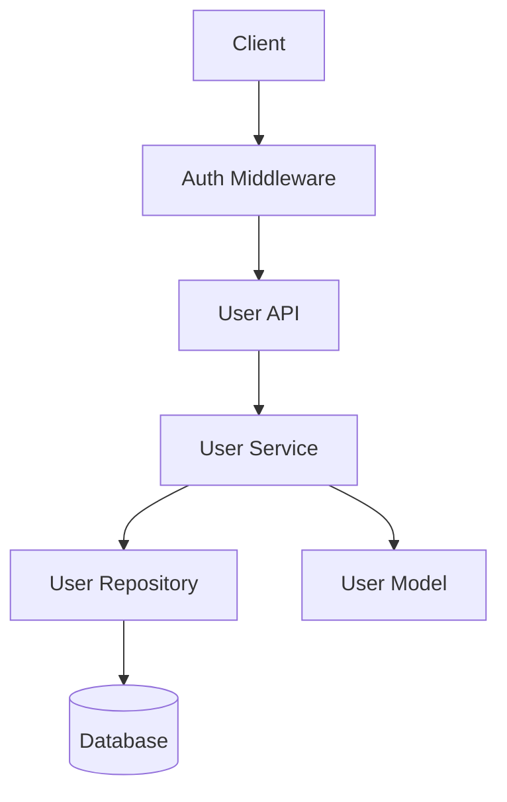

# 技術設計書

## Overview

本機能は、認証済みユーザーが自分のパスワードを安全に変更するためのAPIを提供する。ユーザーは現在のパスワードを確認した後、新しいパスワードを設定できる。

**目的**: ユーザーがアカウントセキュリティを向上させ、定期的なパスワード更新を可能にする。

**ユーザー**: 認証済みユーザーが自分のパスワードを変更するために利用する。

**影響**: 既存のユーザー管理モジュール（`UserService`、`user.py`）を拡張し、新しいエンドポイントを追加する。

### Goals
- ユーザーが自分のパスワードを安全に変更できる
- 現在のパスワード確認による不正変更の防止
- 一貫したAPIレスポンス形式の提供

### Non-Goals
- パスワードリセット（メール経由のリセットリンク送信）
- パスワード強度ポリシーの追加（8文字以上のみ）
- レート制限やアカウントロック機能

## Architecture

### Existing Architecture Analysis

本機能は既存のユーザー管理モジュールを拡張する。

- **現在のアーキテクチャパターン**: 3層アーキテクチャ（API層 → Service層 → Repository層）
- **既存のドメイン境界**: `UserService`がユーザー関連操作を管理
- **統合ポイント**: `user.py`（API層）、`UserService`（Service層）、`UserRepository`（Repository層）
- **技術的負債**: なし（既存パターンを踏襲）

### Architecture Pattern & Boundary Map



**Architecture Integration**:
- **Selected pattern**: 既存の3層アーキテクチャを拡張
- **Domain/feature boundaries**: ユーザー管理ドメイン内で完結
- **Existing patterns preserved**: JWT認証、共通レスポンス形式、カスタム例外
- **New components rationale**: なし（既存コンポーネントの拡張のみ）
- **Steering compliance**: プロジェクト構造ガイドラインに準拠

### Technology Stack

| Layer | Choice / Version | Role in Feature | Notes |
|-------|------------------|-----------------|-------|
| Backend / Services | Flask 3.1.0 | APIエンドポイント | 既存 |
| Data / Storage | SQLAlchemy 2.0.40 | ORM | 既存 |
| Security | werkzeug 3.0.x | パスワードハッシュ化 | 既存 |
| Auth | flask-jwt-extended 4.7.1 | JWT認証 | 既存 |

## Requirements Traceability

| Requirement | Summary | Components | Interfaces | Flows |
|-------------|---------|------------|------------|-------|
| 1.1 | パスワード変更の基本動作 | UserService | change_password | メインフロー |
| 1.2 | 成功レスポンス | UserAPI | POST /change-password | 正常系 |
| 1.3 | ユーザー不在エラー | UserService | UserNotFoundError | 例外フロー |
| 2.1 | current_password要求 | UserAPI | Request Body | 入力検証 |
| 2.2 | パスワード不一致エラー | UserService | InvalidPasswordError | 例外フロー |
| 2.3 | パスワード未指定エラー | UserAPI | 400 Bad Request | 入力検証 |
| 3.1 | new_password要求 | UserAPI | Request Body | 入力検証 |
| 3.2 | 8文字未満エラー | UserService | ValueError | 入力検証 |
| 3.3 | パスワード未指定エラー | UserAPI | 400 Bad Request | 入力検証 |
| 3.4 | 空文字列エラー | UserService | ValueError | 入力検証 |
| 3.5 | ハッシュ化保存 | UserModel | set_password | データ処理 |
| 4.1 | JWT未認証エラー | AuthMiddleware | 401 Unauthorized | 認証 |
| 4.2 | 他ユーザー変更禁止 | UserAPI | 403 Forbidden | 認可 |
| 4.3 | 自分のみ変更許可 | UserAPI | JWT検証 | 認可 |
| 5.1 | JSON受信 | UserAPI | Request Parser | 入力形式 |
| 5.2 | 必須フィールド | UserAPI | Request Body | 入力形式 |
| 5.3 | 無効JSONエラー | UserAPI | 400 Bad Request | 入力形式 |
| 6.1 | 成功レスポンス形式 | UserAPI | success_response | 出力形式 |
| 6.2 | HTTP 200 | UserAPI | Response | 出力形式 |
| 6.3 | エラーレスポンス形式 | UserAPI | error response | 出力形式 |
| 6.4 | 共通ユーティリティ使用 | UserAPI | response_utils.py | 実装パターン |
| 7.1 | DBエラーハンドリング | UserAPI | 500 Internal Server Error | 例外処理 |
| 7.2 | 予期しない例外 | UserAPI | 汎用エラー | 例外処理 |
| 7.3 | 共通エラーハンドラ使用 | UserAPI | error_handlers.py | 実装パターン |
| 8.1 | 変更ログ記録 | UserService | logger.info | 監査 |
| 8.2 | 失敗ログ記録 | UserService | logger.warning | 監査 |
| 8.3 | パスワード非ログ | UserService | - | セキュリティ |

## Components and Interfaces

### Summary Table

| Component | Domain/Layer | Intent | Req Coverage | Key Dependencies | Contracts |
|-----------|--------------|--------|--------------|------------------|-----------|
| UserAPI | API | パスワード変更エンドポイント | 1-6, 7.1-7.3 | UserService (P0), AuthMiddleware (P0) | API |
| UserService | Service | パスワード変更ビジネスロジック | 1.1-1.3, 2.1-2.2, 3.2-3.5, 8.1-8.3 | UserRepository (P0), UserModel (P0) | Service |
| UserModel | Model | パスワードハッシュ化 | 3.5 | werkzeug (P0) | - |

### API Layer

#### UserAPI (change_password endpoint)

| Field | Detail |
|-------|--------|
| Intent | パスワード変更リクエストを受け付け、UserServiceに処理を委譲する |
| Requirements | 1.1-1.2, 2.1, 2.3, 3.1, 3.3, 4.1-4.3, 5.1-5.3, 6.1-6.4, 7.1-7.3 |

**Responsibilities & Constraints**
- JWT認証の確認（`@jwt_required_custom`デコレータ）
- リクエストボディのバリデーション
- ユーザーID一致確認（認可）
- 適切なHTTPステータスとレスポンス形式の返却

**Dependencies**
- Inbound: Client — HTTPリクエスト (P0)
- Outbound: UserService — change_password呼び出し (P0)
- External: AuthMiddleware — JWT検証 (P0)

**Contracts**: Service [ ] / API [x] / Event [ ] / Batch [ ] / State [ ]

##### API Contract

| Method | Endpoint | Request | Response | Errors |
|--------|----------|---------|----------|--------|
| POST | /api/v1/users/{userId}/change-password | ChangePasswordRequest | SuccessResponse | 400, 401, 403, 404, 500 |

**Request Schema**:
```json
{
  "current_password": "string (required)",
  "new_password": "string (required, min 8 chars)"
}
```

**Response Schema (Success)**:
```json
{
  "data": {
    "message": "パスワードが正常に変更されました"
  }
}
```

**Response Schema (Error)**:
```json
{
  "error": {
    "code": 400,
    "message": "エラーメッセージ"
  }
}
```

**Implementation Notes**
- Integration: `success_response()`を使用して一貫したレスポンス形式を提供
- Validation: JSONパース失敗時は400 Bad Requestを返す
- Risks: パスワードがログに出力されないよう注意

### Service Layer

#### UserService (change_password method)

| Field | Detail |
|-------|--------|
| Intent | 現在のパスワードを検証し、新しいパスワードを設定する |
| Requirements | 1.1-1.3, 2.2, 3.2, 3.4, 3.5, 8.1-8.3 |

**Responsibilities & Constraints**
- ユーザーの存在確認
- 現在のパスワード検証
- 新しいパスワードのバリデーション（8文字以上）
- パスワードのハッシュ化と保存
- 監査ログの記録（パスワードは除外）

**Dependencies**
- Inbound: UserAPI — change_password呼び出し (P0)
- Outbound: UserRepository — find_by_id, save (P0)
- Outbound: UserModel — check_password, set_password (P0)

**Contracts**: Service [x] / API [ ] / Event [ ] / Batch [ ] / State [ ]

##### Service Interface

```python
def change_password(self, user_id: int, current_password: str, new_password: str) -> None:
    """
    ユーザーのパスワードを変更する。

    Args:
        user_id: ユーザーID
        current_password: 現在のパスワード
        new_password: 新しいパスワード

    Raises:
        UserNotFoundError: ユーザーが存在しない場合
        InvalidPasswordError: 現在のパスワードが正しくない場合
        ValueError: 新しいパスワードがバリデーションを通過しない場合
    """
```

- Preconditions:
  - `user_id` > 0
  - `current_password` が空でない
  - `new_password` が8文字以上
- Postconditions:
  - ユーザーのパスワードハッシュが更新されている
  - 変更がログに記録されている
- Invariants:
  - パスワードは平文で保存されない
  - パスワードはログに出力されない

**Implementation Notes**
- Integration: `User.check_password()`で現在のパスワードを検証、`User.set_password()`で新しいパスワードを設定
- Validation: `ValidationConstants.PASSWORD_MIN_LENGTH`を使用して8文字以上を確認
- Risks: トランザクションの一貫性を確保

## Data Models

### Domain Model

**Aggregate**: User
- **Entity**: User (既存)
- **変更点**: なし（既存の`password_hash`フィールドを使用）

### Logical Data Model

**影響を受けるテーブル**: `users`
- `password_hash` (VARCHAR(128)): 新しいパスワードのハッシュで更新

**一貫性**:
- トランザクション内で更新
- 外部キー制約への影響なし

### Data Contracts & Integration

**Request Validation**:
- `current_password`: 必須、空文字不可
- `new_password`: 必須、8文字以上

## Error Handling

### Error Strategy

エラーは既存のパターンに従い、カスタム例外とHTTPステータスコードを組み合わせて処理する。

### Error Categories and Responses

| Error Type | HTTP Status | Error Code | Message |
|------------|-------------|------------|---------|
| Invalid JSON | 400 | 400 | Invalid JSON |
| Missing current_password | 400 | 400 | 現在のパスワードが必要です |
| Missing new_password | 400 | 400 | 新しいパスワードが必要です |
| Password too short | 400 | 400 | パスワードは8文字以上必要です |
| Invalid current password | 400 | 400 | 現在のパスワードが正しくありません |
| User not found | 404 | 404 | ユーザーが見つかりません |
| Unauthorized | 401 | 401 | Unauthorized access |
| Forbidden | 403 | 403 | 他のユーザーのパスワードは変更できません |
| Database error | 500 | 500 | Internal server error |

### Monitoring
- 成功時: INFO レベルでユーザーIDとタイムスタンプをログ記録
- 失敗時: WARNING レベルでユーザーIDと失敗理由をログ記録
- パスワード自体はログに出力しない

## Testing Strategy

### Unit Tests
- `UserService.change_password`: 正常なパスワード変更
- `UserService.change_password`: 現在のパスワード不一致
- `UserService.change_password`: 新しいパスワードが短い
- `UserService.change_password`: ユーザー不在
- `User.check_password` / `User.set_password`: ハッシュ化の動作確認

### Integration Tests
- API経由でのパスワード変更成功
- JWT認証なしでのアクセス拒否
- 他ユーザーのパスワード変更拒否
- 無効なリクエストボディでのエラー
- データベースでのパスワード更新確認

### E2E Tests
- （フロントエンド統合時に検討）

## Security Considerations

### 認証・認可
- JWT認証が必須（`@jwt_required_custom`デコレータ）
- 自分のパスワードのみ変更可能（ユーザーID一致確認）

### データ保護
- パスワードは`werkzeug.security.generate_password_hash`でハッシュ化
- パスワードはログに出力しない
- HTTPS通信を前提（本番環境）

### 脅威モデリング
- **ブルートフォース攻撃**: スコープ外（将来的にレート制限で対応予定）
- **セッションハイジャック**: JWTの有効期限で軽減
- **パスワード推測**: 8文字以上の要件で軽減
