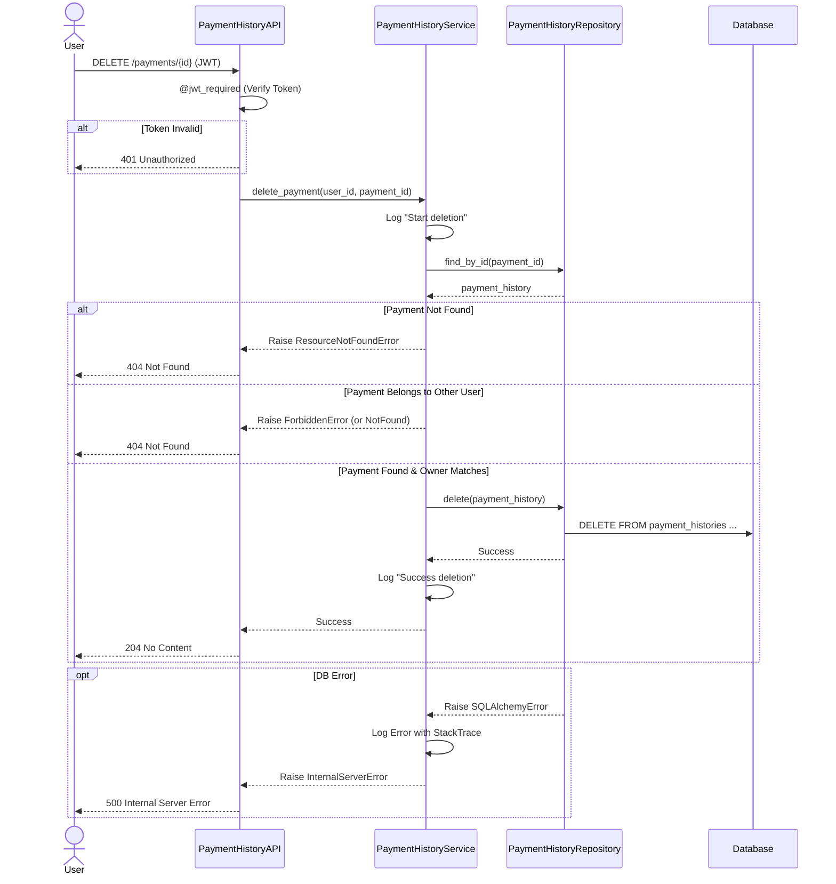

# 設計書

---
**目的**: 実装者間での一貫性を確保し、解釈のずれを防ぐために十分な詳細を提供する。

**アプローチ**:
- 実装の決定に直接影響する必須セクションを含める
- 実装ミスを防ぐために不可欠な場合を除き、オプションのセクションは省略する
- 機能の複雑さに応じた詳細レベルにする
- 長い散文よりも図や表を使用する

**警告**: 1000行に近づく場合は、機能の複雑さが過剰であり、設計の簡素化が必要であることを示唆している。
---

## 概要
**目的**: 本機能は、ユーザーが登録済みの支払履歴レコードを削除できるようにするものである。
**ユーザー**: 個人ユーザーは、誤った記録や不要な支払記録を削除し、正確な支出履歴を維持するためにこれを利用する。
**影響**: データベースから `PaymentHistory` レコードを物理的に削除することで、現在のシステム状態を変更する。

### ゴール
- ユーザーが特定の支払履歴レコードをID指定で削除できるようにする。
- ユーザーが自身のレコードのみを削除できるよう、厳密なセキュリティを確保する。
- 監査およびトラブルシューティングのために適切なログ記録を提供する。

### ノンゴール（対象外）
- 支払履歴の一括削除。
- 論理削除（要件では物理削除が指定されている）。
- 削除後の取り消し（Undo）機能。

## アーキテクチャ

### アーキテクチャパターンと境界マップ
**アーキテクチャ統合**:
- **選択したパターン**: レイヤードアーキテクチャ (Controller -> Service -> Repository)。
- **ドメイン/機能の境界**: `PaymentHistory` ドメインは独自のライフサイクルを管理する。
- **維持される既存パターン**: Flask Blueprints、SQLAlchemy ORM、および検証用の Pydantic/Marshmallow を使用。
- **新規コンポーネントの根拠**: 新規アーキテクチャコンポーネントはなし。既存の `PaymentHistoryService` と `PaymentHistoryAPI` を拡張する。
- **Steering準拠**: `structure.md` で定義された3層アーキテクチャに準拠する。

### 技術スタック

| レイヤー | 選択 / バージョン | 機能における役割 | 備考 |
|-------|------------------|-----------------|-------|
| Backend / Services | Flask 3.1.0 | API Endpoint | `DELETE /payments/{id}` |
| Backend / Services | Python 3.13 | Business Logic | `PaymentHistoryService` |
| Data / Storage | SQLAlchemy ^2.0.40 | Data Access | `PaymentHistoryRepository` |
| Infrastructure | Logging (stdlib) | Audit | 削除イベントのログ記録 |

## システムフロー



## 要件トレーサビリティ

| 要件ID | サマリー | コンポーネント | インターフェース | フロー |
|-------------|---------|------------|------------|-------|
| 1.1 | IDによる物理削除 | PaymentHistoryService, PaymentHistoryRepository | delete_payment, delete | 上記シーケンス |
| 1.2 | 成功時に204を返却 | PaymentHistoryAPI | DELETE /payments/{id} | 上記シーケンス |
| 1.3 | 存在しない場合404を返却 | PaymentHistoryService | delete_payment | 上記シーケンス |
| 1.4 | 所有者でない場合404を返却 | PaymentHistoryService | delete_payment | 上記シーケンス |
| 1.5 | DBエラー時に500を返却 | PaymentHistoryService | delete_payment | 上記シーケンス |
| 2.1 | JWTトークンの検証 | PaymentHistoryAPI | @jwt_required | 上記シーケンス |
| 2.2 | 無効なトークンなら401返却 | PaymentHistoryAPI | @jwt_required | 上記シーケンス |
| 2.3 | 所有権の検証 | PaymentHistoryService | delete_payment | 上記シーケンス |
| 3.1 | 処理開始ログ | PaymentHistoryService | delete_payment | 上記シーケンス |
| 3.2 | 完了ログ | PaymentHistoryService | delete_payment | 上記シーケンス |
| 3.3 | エラー詳細ログ | PaymentHistoryService | delete_payment | 上記シーケンス |

## コンポーネントとインターフェース

| コンポーネント | ドメイン/レイヤー | 意図 | 要件カバレッジ | キー依存関係 (P0/P1) | 契約 |
|-----------|--------------|--------|--------------|--------------------------|-----------|
| PaymentHistoryAPI | API | DELETEエンドポイントの公開 | 1.2, 2.1, 2.2 | PaymentHistoryService (P0) | API |
| PaymentHistoryService | Service | ビジネスロジックと検証 | 1.1, 1.3-1.5, 2.3, 3.1-3.3 | PaymentHistoryRepository (P0) | Service |
| PaymentHistoryRepository | Repository | DBアクセス | 1.1 | SQLAlchemy Session (P0) | Service |

### Service / Backend

#### PaymentHistoryService

| 項目 | 詳細 |
|-------|--------|
| 意図 | 支払履歴削除のビジネスロジックを処理する |
| 要件 | 1.1, 1.3, 1.4, 1.5, 2.3, 3.1, 3.2, 3.3 |

**責任と制約**
- 支払レコードのユーザー所有権を検証する。
- プロセスの実行をログに記録する（開始/成功/エラー）。
- リポジトリに削除を委譲する。
- **トランザクション範囲**: リクエストごとに単一のアトミックなトランザクション。

**依存関係**
- 入力: `PaymentHistoryAPI` — 削除メソッドを呼び出す (P0)
- 出力: `PaymentHistoryRepository` — DB削除を実行する (P0)
- 外部: `Logger` — 監査ログを記録する (P1)

**契約**: Service [x] / API [ ] / Event [ ] / Batch [ ] / State [ ]

##### サービスインターフェース
```python
class PaymentHistoryService:
    def delete_payment(self, user_id: int, payment_id: int) -> None:
        """
        Deletes a payment history record.
        
        Args:
            user_id: ID of the authenticated user.
            payment_id: ID of the payment to delete.
            
        Raises:
            ResourceNotFoundError: If payment does not exist.
            ForbiddenError: If payment belongs to another user.
            SQLAlchemyError: If database operation fails.
        """
        pass
```
- 事前条件: `user_id` が有効であること。
- 事後条件: レコードがDBから削除されること。
- 不変条件: なし。

**実装ノート**
- **統合**:
  - `payment_id` で支払情報を取得する。
  - `payment.user_id == user_id` をチェックする。
  - 不一致の場合、要件1.4（セキュリティ隠蔽）を満たすため、`ResourceNotFoundError`（またはAPIで404として処理される `ForbiddenError`）を発生させる。
- **検証**:
  - `payment_id` が存在することを確認する。
- **リスク**:
  - 機密データのログ記録？ -> PII（個人特定情報）ではなく、IDのみを記録するようにする。

### API / Backend

#### PaymentHistoryAPI

| 項目 | 詳細 |
|-------|--------|
| 意図 | 削除用RESTエンドポイントを公開する |
| 要件 | 1.2, 2.1, 2.2 |

**責任と制約**
- JWTによるユーザー認証。
- URLからの `payment_id` のパース。
- 例外の処理とHTTPステータスコードへのマッピング。

**依存関係**
- 出力: `PaymentHistoryService` — ビジネスロジックを呼び出す (P0)

**契約**: Service [ ] / API [x] / Event [ ] / Batch [ ] / State [ ]

##### API契約
| メソッド | エンドポイント | リクエスト | レスポンス | エラー |
|--------|----------|---------|----------|--------|
| DELETE | /payments/{id} | N/A | 204 No Content | 401, 403, 404, 500 |

**実装ノート**
- `@jwt_required()` デコレータを使用する。
- `ResourceNotFoundError` をキャッチ -> 404。
- `ForbiddenError` をキャッチ -> 404（セキュリティ要件）。

## データモデル

### 物理データモデル
スキーマの変更は不要。`PaymentHistory` テーブルは既に存在し、削除をサポートしている。

**一貫性と整合性**:
- `user_id` FK には `ondelete="CASCADE"` が設定されている（ユーザー削除時に支払履歴も削除される）。
- `subscription_id` FK には `ondelete="SET NULL"` が設定されている（サブスクリプション削除時に支払のsub_idはNULLになる）。
- `PaymentHistory` の削除による他テーブルへのカスケード影響はない（このコンテキストではリーフノードである）。

## エラーハンドリング

### エラー戦略
- **ユーザーエラー**: 
  - 404: 支払が見つからない（またはアクセス拒否）。
  - 401: 未認証（JWT欠落/無効）。
- **システムエラー**:
  - 500: データベース接続失敗または未処理の例外。

### モニタリング
- **ログ記録**:
  - INFO: "Starting deletion of payment_id={id} for user_id={uid}"
  - INFO: "Successfully deleted payment_id={id}"
  - ERROR: "Failed to delete payment_id={id}: {error_details}" (スタックトレースを含める)

## テスト戦略

- **ユニットテスト**:
  - `test_delete_payment_success`: リポジトリの `delete` が呼び出されることを検証。
  - `test_delete_payment_not_found`: IDが存在しない場合に `ResourceNotFoundError` を検証。
  - `test_delete_payment_forbidden`: ユーザー不一致の場合に `ForbiddenError`（または `ResourceNotFoundError`）を検証。
  - `test_delete_payment_logging`: 開始/終了ログが出力されることを検証。
- **統合テスト**:
  - `test_api_delete_payment_204`: APIを呼び出し、204を確認し、DBからレコードが消えていることを確認。
  - `test_api_delete_payment_404_not_found`: 存在しないIDでAPIを呼び出す。
  - `test_api_delete_payment_404_other_user`: 他ユーザーのIDでAPIを呼び出す。
  - `test_api_delete_payment_401`: トークンなしでAPIを呼び出す。