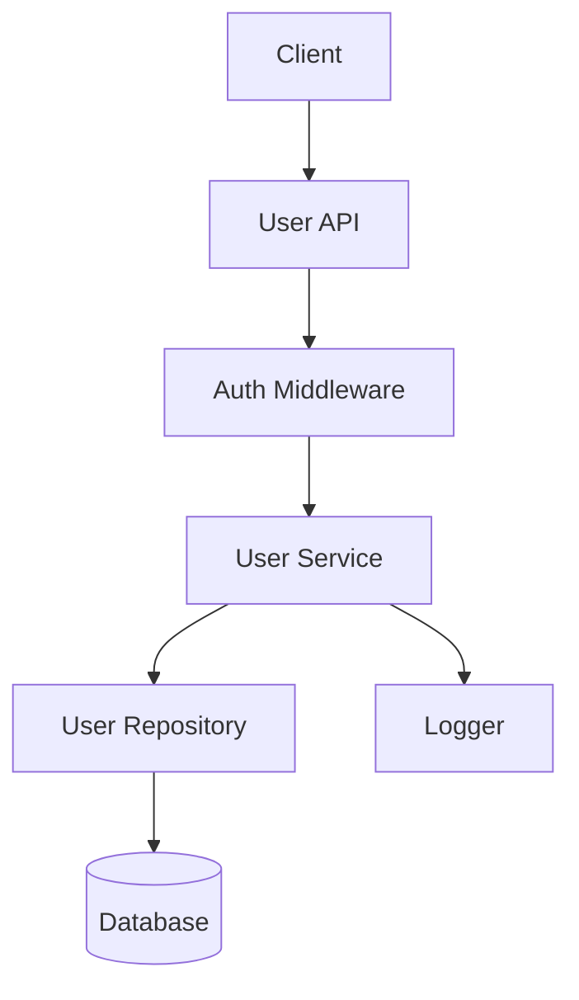
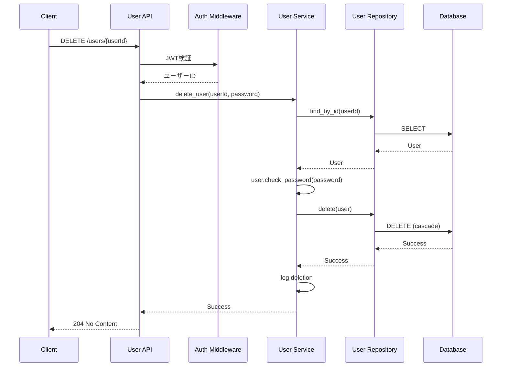
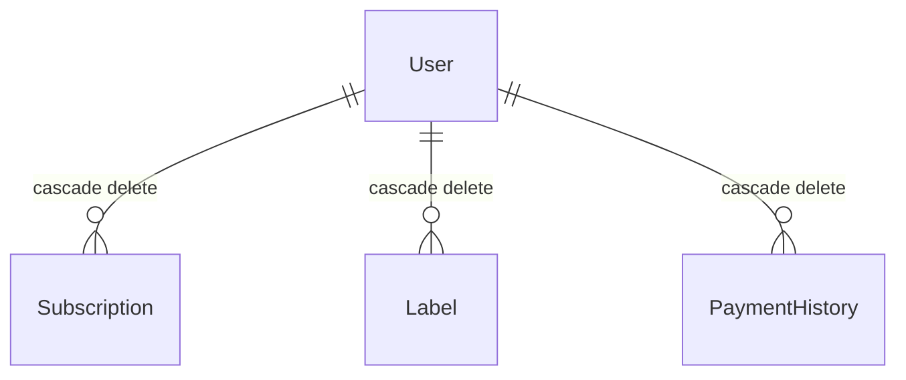

# 設計ドキュメント: アカウント削除API

## Overview

本機能は、認証済みユーザーが自分のアカウントを削除するためのAPI `DELETE /api/v1/users/{userId}` を提供する。

**Purpose**: ユーザーがサービス利用を停止し、すべての個人データを完全に削除する手段を提供する。

**Users**: 登録済みユーザーがアカウント削除のために利用する。

**Impact**: 新規DELETEエンドポイントを追加し、UserServiceおよびUserRepositoryに削除機能を拡張する。

### Goals
- 安全なアカウント削除機能の提供
- パスワード確認による誤操作防止
- 関連データ(subscriptions, labels, payment_histories)の完全削除
- 監査ログの記録

### Non-Goals
- 管理者によるユーザー削除機能
- 論理削除(soft delete)の実装
- JWTトークンの即時無効化(トークンブロックリスト)

## Architecture

### Existing Architecture Analysis
- **Current Pattern**: 3層アーキテクチャ (API → Service → Repository)
- **Existing Components**: `user.py` (API), `user_service.py` (Service), `user_repository.py` (Repository)
- **Integration Points**: `auth_middleware.py` (JWT認証), `error_handlers.py` (エラーハンドリング)
- **Technical Debt**: なし (既存パターン踏襲)

### Architecture Pattern & Boundary Map



**Architecture Integration**:
- Selected pattern: 既存3層アーキテクチャの拡張
- Domain/feature boundaries: Userドメイン内で完結
- Existing patterns preserved: JWT認証、エラーハンドリング、ロギング
- New components rationale: なし (既存コンポーネント拡張)
- Steering compliance: 3層アーキテクチャ、Blueprint-based Routing準拠

### Technology Stack

| Layer | Choice / Version | Role in Feature | Notes |
|-------|------------------|-----------------|-------|
| Backend | Python 3.13 | API実装言語 | 既存 |
| Backend | Flask 3.1.0 | Webフレームワーク | 既存 |
| Backend | SQLAlchemy 2.0.40 | ORM | 既存 |
| Auth | flask-jwt-extended 4.7.1 | JWT認証 | 既存 |
| Logging | logging (標準) | 監査ログ | 既存 |

## System Flows



**Key Flow Decisions**:
- パスワード検証はService層で実行
- DB削除はUserモデルのcascade設定に依存(個別削除処理不要)
- ログ記録はService層で実行

## Requirements Traceability

| Requirement | Summary | Components | Interfaces | Flows |
|-------------|---------|------------|------------|-------|
| 1.1 | DELETE /api/v1/users/{userId} でアカウント削除 | User API, User Service | delete_user API | Sequence |
| 1.2 | 204 No Content返却 | User API | Response | Sequence |
| 1.3 | 存在しないユーザーは404 | User Service | Exception | Sequence |
| 1.4 | JWTトークン無効化 | N/A | N/A | Non-Goal |
| 2.1 | passwordフィールド要求 | User API | Request Body | Sequence |
| 2.2 | パスワード不一致は400 | User Service | Exception | Sequence |
| 2.3 | パスワード未指定は400 | User API | Validation | Sequence |
| 3.1 | トークン未付与は401 | Auth Middleware | JWT Error | Sequence |
| 3.2 | 他ユーザー削除は403 | User API | Authorization | Sequence |
| 3.3 | 自分のみ削除可能 | User API | Authorization | Sequence |
| 4.1 | サブスクリプション削除 | User Model | cascade | DB |
| 4.2 | ラベル削除 | User Model | cascade | DB |
| 4.3 | 支払い履歴削除 | User Model | cascade | DB |
| 4.4 | 外部キー制約準拠 | User Model | cascade | DB |
| 5.1 | DBエラーは500 | Error Handlers | Exception Handler | N/A |
| 5.2 | 予期しない例外は汎用エラー | Error Handlers | Exception Handler | N/A |
| 5.3 | 共通エラーハンドラ使用 | Error Handlers | JSON Response | N/A |
| 6.1 | 削除操作ログ記録 | User Service | Logger | Sequence |
| 6.2 | 失敗詳細ログ記録 | User Service | Logger | Sequence |

## Components and Interfaces

| Component | Domain/Layer | Intent | Req Coverage | Key Dependencies | Contracts |
|-----------|--------------|--------|--------------|------------------|-----------|
| User API | API Layer | DELETE エンドポイント | 1.1-3.3, 2.1-2.3 | Auth Middleware (P0), User Service (P0) | API |
| User Service | Service Layer | 削除ビジネスロジック | 1.3, 2.2, 4.1-4.4, 6.1-6.2 | User Repository (P0), Logger (P1) | Service |
| User Repository | Repository Layer | データ削除 | 4.1-4.4 | Database (P0) | Service |

### API Layer

#### User API (app/api/v1/user.py)

| Field | Detail |
|-------|--------|
| Intent | DELETE /users/{userId} エンドポイントの提供 |
| Requirements | 1.1, 1.2, 2.1, 2.3, 3.1, 3.2, 3.3 |
| Owner / Reviewers | Backend Team |

**Responsibilities & Constraints**
- JWT認証の実施
- ユーザーIDの整合性チェック(トークンvsパスパラメータ)
- リクエストボディのバリデーション
- 適切なHTTPステータスコード返却

**Dependencies**
- Inbound: Client — DELETE リクエスト (P0)
- Outbound: Auth Middleware — JWT検証 (P0)
- Outbound: User Service — 削除処理 (P0)

**Contracts**: Service [ ] / API [x] / Event [ ] / Batch [ ] / State [ ]

##### API Contract

| Method | Endpoint | Request | Response | Errors |
|--------|----------|---------|----------|--------|
| DELETE | /api/v1/users/{userId} | `{"password": string}` | 204 No Content | 400, 401, 403, 404, 500 |

**Request Schema**:
```json
{
  "password": "string (required)"
}
```

**Response Schema**: 204 No Content (bodyなし)

**Error Responses**:
- 400: `{"error": {"code": 400, "message": "パスワードが正しくありません"}}`
- 400: `{"error": {"code": 400, "message": "パスワードが必要です"}}`
- 401: `{"error": {"code": 401, "message": "Unauthorized access"}}`
- 403: `{"error": {"code": 403, "message": "他のユーザーのアカウントは削除できません"}}`
- 404: `{"error": {"code": 404, "message": "ユーザーが見つかりません"}}`
- 500: `{"error": {"code": 500, "message": "Internal server error"}}`

**Implementation Notes**
- Integration: 既存`user_bp` Blueprintに追加
- Validation: `request.get_json()`でパスワード有無をチェック
- Risks: パスワード未指定時の早期バリデーション

### Service Layer

#### User Service (app/services/user_service.py)

| Field | Detail |
|-------|--------|
| Intent | ユーザー削除のビジネスロジック実行 |
| Requirements | 1.3, 2.2, 4.1-4.4, 6.1, 6.2 |
| Owner / Reviewers | Backend Team |

**Responsibilities & Constraints**
- ユーザー存在確認
- パスワード検証
- 削除実行(Repository委譲)
- 監査ログ記録

**Dependencies**
- Inbound: User API — delete_user呼び出し (P0)
- Outbound: User Repository — データ削除 (P0)
- Outbound: Logger — ログ記録 (P1)

**Contracts**: Service [x] / API [ ] / Event [ ] / Batch [ ] / State [ ]

##### Service Interface

```python
class UserService:
    def delete_user(self, user_id: int, password: str) -> None:
        """
        ユーザーアカウントを削除する。

        Args:
            user_id: 削除対象のユーザーID
            password: 確認用パスワード

        Raises:
            UserNotFoundError: ユーザーが存在しない場合
            InvalidPasswordError: パスワードが不正な場合
        """
```

- Preconditions: ユーザーが認証済み、user_idがトークンと一致
- Postconditions: ユーザーおよび関連データが削除される
- Invariants: 削除は冪等

**Implementation Notes**
- Integration: 既存UserServiceクラスにメソッド追加
- Validation: `user.check_password(password)`でパスワード検証
- Risks: DBエラー時のトランザクションロールバック

### Repository Layer

#### User Repository (app/repositories/user_repository.py)

| Field | Detail |
|-------|--------|
| Intent | ユーザーデータの削除 |
| Requirements | 4.1, 4.2, 4.3, 4.4 |
| Owner / Reviewers | Backend Team |

**Responsibilities & Constraints**
- ユーザーレコードの削除
- カスケード削除はUserモデルの設定に依存

**Dependencies**
- Inbound: User Service — delete呼び出し (P0)
- Outbound: Database — DELETE実行 (P0)

**Contracts**: Service [x] / API [ ] / Event [ ] / Batch [ ] / State [ ]

##### Service Interface

```python
class UserRepository:
    def delete(self, user: User) -> None:
        """
        ユーザーを削除する。

        Args:
            user: 削除対象のUserモデルインスタンス
        """
```

- Preconditions: userが永続化されている
- Postconditions: ユーザーと関連データが削除される
- Invariants: トランザクション内で実行

**Implementation Notes**
- Integration: 既存UserRepositoryクラスにメソッド追加
- Validation: なし( Service層で検証済み)
- Risks: 外部キー制約エラー(SQLiteのPRAGMA foreign_keys=ON確認)

## Data Models

### Domain Model

**Aggregate Root**: User

**Entities**:
- User: 削除対象の集約ルート

**Value Objects**: なし(本機能固有)

**Domain Events**: なし

**Business Rules & Invariants**:
- ユーザーは自分自身のアカウントのみ削除可能
- パスワード確認が必要

### Logical Data Model

**Structure Definition**:
- User (削除対象)
  - subscriptions: 1:N (cascade delete)
  - labels: 1:N (cascade delete)
  - payment_histories: 1:N (cascade delete)

**Consistency & Integrity**:
- Transaction boundary: 単一トランザクション
- Cascading rules: `cascade="all, delete-orphan"` (Userモデル定義済み)

### Physical Data Model

変更なし。既存Userモデルのcascade設定を利用。



## Error Handling

### Error Strategy

既存の共通エラーハンドラ(`app/common/error_handlers.py`)を使用し、一貫したエラーレスポンス形式を維持する。

### Error Categories and Responses

**User Errors (4xx)**:
- 400 Bad Request: パスワード未指定、パスワード不一致
- 401 Unauthorized: JWTトークン無効/期限切れ
- 403 Forbidden: 他ユーザーのアカウント削除試行
- 404 Not Found: ユーザーが存在しない

**System Errors (5xx)**:
- 500 Internal Server Error: データベースエラー、予期しない例外

### Monitoring

- 削除成功/失敗をログ記録(ユーザーID、タイムスタンプ)
- 予期しない例外は`logger.exception()`でスタックトレース記録

## Testing Strategy

### Unit Tests
- UserService.delete_user正常系
- UserService.delete_user パスワード不一致
- UserService.delete_user ユーザー不在
- UserRepository.delete正常系

### Integration Tests
- DELETE /api/v1/users/{userId} 正常系(204)
- DELETE /api/v1/users/{userId} 認証エラー(401)
- DELETE /api/v1/users/{userId} 認可エラー(403)
- DELETE /api/v1/users/{userId} パスワードエラー(400)
- DELETE /api/v1/users/{userId} 関連データ削除確認

## Security Considerations

- **Authentication**: JWT認証必須(`@jwt_required_custom`)
- **Authorization**: トークン所有者のみ削除可能
- **Password Verification**: 削除前にパスワード確認必須
- **Data Protection**: カスケード削除により関連データ完全削除

## Supporting References

### 例外クラス追加

```python
# app/exceptions.py に追加
class UserNotFoundError(Exception):
    """指定されたユーザーが見つからない場合に発生する例外。"""
    pass

class InvalidPasswordError(Exception):
    """パスワードが正しくない場合に発生する例外。"""
    pass
```

### エラーメッセージ追加

```python
# app/constants.py ErrorMessages に追加
INVALID_PASSWORD = "パスワードが正しくありません"
PASSWORD_REQUIRED = "パスワードが必要です"
CANNOT_DELETE_OTHER_USER = "他のユーザーのアカウントは削除できません"
```
