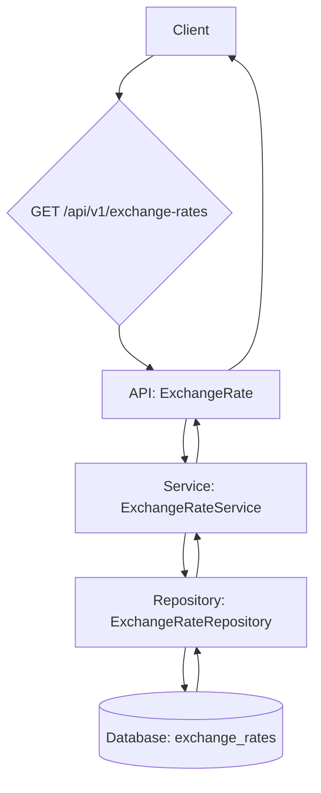

# 技術設計書: 為替レートAPI

## 概要
**目的**: この機能は、指定された日付と通貨ペアに対応する為替レートを提供するREST APIエンドポイントを実装します。
**ユーザー**: 主にフロントエンドアプリケーションがこのAPIを利用し、サブスクリプション料金をユーザーの現地通貨に換算します。
**インパクト**: 既存のシステムに新しい読み取り専用のエンドポイントを追加します。

### ゴール
- `date`, `from_currency`, `to_currency` に基づいて為替レートを返す `GET /api/v1/exchange-rates` エンドポイントを作成する。
- 指定された日付にレートが存在しない場合、直近の過去のレートを返すフォールバックロジックを実装する。
- 既存のアーキテクチャとコーディング規約に準拠する。

### 対象外
- 為替レートの作成、更新、削除機能（これらは別のバッチプロセスが担当）。
- リアルタイムでの為替レート取得。

## アーキテクチャ

### 既存アーキテクチャ分析
当アプリケーションは、`structure.md` と `tech.md` に記載されている通り、以下の特徴を持つ3層アーキテクチャを採用しています。
- **API層**: Flask Blueprintを使用し、HTTPリクエストの受付と基本的なバリデーションを担当。
- **サービス層**: ビジネスロジックを実装。
- **リポジトリ層**: SQLAlchemyを介したデータベースとのやり取りを抽象化。

本機能はこの既存パターンを踏襲し、各層に新しいコンポーネントを追加します。

### ハイレベルアーキテクチャ


### 技術スタックと設計判断
この機能は既存の技術スタック（Python, Flask, SQLAlchemy）をそのまま利用するため、新しいライブラリの導入や技術的な変更はありません。既存の設計パターンに準拠して実装します。

## システムフロー
### 為替レート取得シーケンス
```mermaid
sequenceDiagram
    participant Client
    participant API
    participant Service
    participant Repository
    participant DB

    Client->>+API: GET /api/v1/exchange-rates?date=...&from=...&to=...
    API->>+Service: get_exchange_rate(date, from, to)
    Service->>+Repository: find_rate_by_date(date, from, to)
    Repository->>+DB: SELECT rate FROM exchange_rates WHERE ... ORDER BY date DESC LIMIT 1
    DB-->>-Repository: ExchangeRate or None
    Repository-->>-Service: ExchangeRate or None
    alt レートが存在する場合
        Service-->>-API: ExchangeRate Data
        API-->>-Client: 200 OK with rate data
    else レートが存在しない場合
        Service-->>-API: NotFoundException
        API-->>-Client: 404 Not Found
    end
```

## コンポーネントとインターフェース

### API層
#### `app.api.v1.exchange_rate`
**責務**: HTTPリクエストを受け付け、クエリパラメータを検証し、サービス層を呼び出して結果を返す。
**API契約**:
| Method | Endpoint | Request (Query Params) | Response (Success) | Response (Error) |
|--------|----------|------------------------|--------------------|------------------|
| GET | /exchange-rates | `date: str`, `from_currency: str`, `to_currency: str` | `200 OK` with `{"rate": float}` | `400 Bad Request`, `404 Not Found` |

### サービス層
#### `app.services.exchange_rate_service.ExchangeRateService`
**責務**: 為替レート取得のビジネスロジックを担当する。リポジトリからデータを取得し、見つからない場合はエラーを発生させる。
**サービスインターフェース**:
```python
class ExchangeRateService:
    def get_exchange_rate(self, target_date: date, from_currency: str, to_currency: str) -> ExchangeRate:
        # Precondition: パラメータは型検証済みであること
        # Postcondition: ExchangeRateオブジェクトを返すか、例外を発生させる
        ...
```

### リポジトリ層
#### `app.repositories.exchange_rate_repository.ExchangeRateRepository`
**責務**: データベースから為替レートデータを直接取得する。
**サービスインターフェース**:
```python
class ExchangeRateRepository:
    def find_rate_by_date(self, target_date: date, from_currency: str, to_currency: str) -> Optional[ExchangeRate]:
        # 指定された日付以前で最新のレートを1件取得するクエリを実行
        ...
```

## データモデル
既存の `app.models.exchange_rate.ExchangeRate` モデルをそのまま利用します。新たなデータモデルの追加や変更はありません。

## エラーハンドリング
| ステータスコード | 状況 | レスポンスボディ |
|---|---|---|
| 400 Bad Request | クエリパラメータ (`date`, `from_currency`, `to_currency`) が欠落している、または `date` の形式が不正。 | `{"error": "Invalid or missing parameters"}` |
| 404 Not Found | 指定された通貨ペアのレートが、指定日以前に存在しない。 | `{"error": "Exchange rate not found"}` |

## テスト戦略
- **単体テスト**:
  - `ExchangeRateRepository`: 指定日にレートがある場合、ない場合、過去にのみある場合のテスト。
  - `ExchangeRateService`: リポジトリがデータを返した場合と`None`を返した場合のテスト。
- **統合テスト**:
  - `GET /api/v1/exchange-rates`: 正常系（200 OK）、パラメータ欠落（400）、レートなし（404）を含むエンドツーエンドのテスト。
