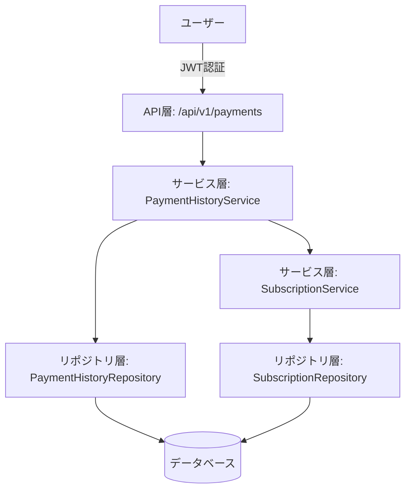
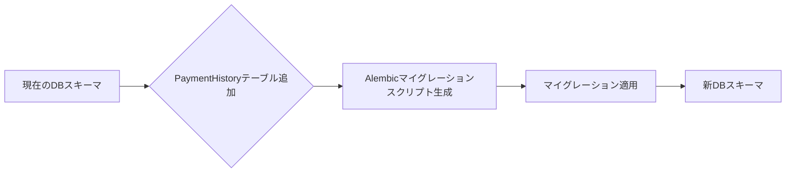

## Overview
**目的**: この機能は、ユーザーが自身のサブスクリプションの支払履歴を効率的に取得できるようにすることで、支出管理の透明性を提供します。
**ユーザー**: サブスクリプションサービスを利用している個人ユーザーが、自身の支払履歴を確認し、支出を追跡するために利用します。
**影響**: 既存のサブスクリプション管理システムに、支払履歴の記録と照会機能を追加します。

### Goals
- ユーザーが自身の支払履歴を安全に取得できること。
- 支払履歴をサブスクリプション別、日付範囲でフィルタリングできること。
- 支払履歴をページネーションで効率的に取得できること。

### Non-Goals
- 支払履歴の編集や削除機能は、本フェーズのスコープ外とします。
- 支払履歴の集計レポートやグラフ表示は、本フェーズのスコープ外とします。

## Architecture

### Existing Architecture Analysis
既存のシステムはFlaskをベースとした3層アーキテクチャ（API層、サービス層、リポジトリ層）を採用しており、SQLAlchemyによるORMとJWT認証を使用しています。この設計は、新しい支払履歴機能にも適用可能であり、既存のパターンを踏襲します。

### High-Level Architecture

**Architecture Integration**:
- **既存パターン**: API層、サービス層、リポジトリ層の分離、SQLAlchemy ORM、JWT認証、Flask Blueprintによるルーティングを維持します。
- **新規コンポーネント**: `PaymentHistory`モデル、`PaymentHistoryRepository`、`PaymentHistoryService`、および`payment_history_bp`（API Blueprint）を新規に作成します。
- **技術スタックの整合性**: 既存のPython 3.13、Flask、SQLAlchemyのスタックに完全に準拠します。
- **ステアリング準拠**: `structure.md`に記載されているレイヤードアーキテクチャと命名規則に準拠します。

### Technology Stack and Design Decisions
**技術スタックの整合性**:
- 本機能は、既存のPython 3.13、Flask 3.1.0、SQLAlchemy 2.xを主要技術として利用します。新たなライブラリやフレームワークの導入は行いません。
- データベースアクセスはSQLAlchemy ORMを通じて行い、既存の`db.Model`を継承したモデルを定義します。

**主要な設計決定**:
- **決定**: 支払履歴のデータモデルは、サブスクリプションとは独立した`PaymentHistory`モデルとして定義する。
- **背景**: 支払履歴はサブスクリプションのイベントであり、サブスクリプション自体とは異なるライフサイクルと属性を持つため、関心の分離を促進します。
- **代替案**:
    1. `Subscription`モデルに支払履歴をJSONBフィールドとして埋め込む。
    2. `Subscription`モデルに支払履歴をリレーションとして持たせるが、`PaymentHistory`モデルは作成しない。
- **選択されたアプローチ**: `PaymentHistory`という独立したモデルを作成し、`Subscription`モデルと1対多のリレーションシップを持たせる。
- **論拠**:
    *   データの正規化と整合性を保ちやすい。
    *   支払履歴に対するクエリ（フィルタリング、ページネーション）を効率的に実行できる。
    *   将来的に支払履歴に特化した機能（例: 支払失敗時のリトライロジック）を追加する際に拡張性が高い。
- **トレードオフ**:
    *   **利点**: 高いデータ整合性、柔軟なクエリ、拡張性。
    *   **欠点**: 新しいモデル、リポジトリ、サービス、APIエンドポイントの作成が必要となり、初期開発コストがわずかに増加する。

## System Flows

### 支払履歴取得シーケンス
```mermaid
sequenceDiagram
    actor User
    participant Client
    participant API_Gateway
    participant PaymentHistoryAPI[API層: /api/v1/payments]
    participant PaymentHistoryService[サービス層: PaymentHistoryService]
    participant PaymentHistoryRepository[リポジトリ層: PaymentHistoryRepository]
    participant DB[データベース]

    User->>Client: 支払履歴を要求
    Client->>PaymentHistoryAPI: GET /api/v1/payments?subscription_id=X&start_date=Y&end_date=Z&limit=L&offset=O (JWT認証ヘッダー付き)
    PaymentHistoryAPI->>PaymentHistoryService: get_payment_history(user_id, filters, pagination)
    PaymentHistoryService->>PaymentHistoryRepository: find_all_by_user_id(user_id, filters, pagination)
    PaymentHistoryRepository->>DB: SELECT * FROM payment_histories WHERE user_id = :user_id AND ... LIMIT :limit OFFSET :offset
    DB-->>PaymentHistoryRepository: 支払履歴データ
    PaymentHistoryRepository-->>PaymentHistoryService: 支払履歴エンティティ
    PaymentHistoryService-->>PaymentHistoryAPI: 支払履歴データ (整形済み)
    PaymentHistoryAPI-->>Client: 200 OK (支払履歴リスト)
    Client-->>User: 支払履歴を表示
```

## Requirements Traceability
| Requirement | Requirement Summary | Components | Interfaces | Flows |
|-------------|---------------------|------------|------------|-------|
| 1.1         | ユーザーが支払履歴を要求した場合、システムはユーザーの支払リストを返却しなければならない。 | PaymentHistoryAPI, PaymentHistoryService, PaymentHistoryRepository | GET /api/v1/payments | 支払履歴取得シーケンス |
| 1.2         | ユーザーに支払履歴が存在しない場合、システムは空のリストを返却しなければならない。 | PaymentHistoryService | get_payment_history | 支払履歴取得シーケンス |
| 1.3         | リスト内の各支払情報には、支払日、金額、通貨、およびサブスクリプション名が含まれなければならない。 | PaymentHistoryModel, PaymentHistoryService | PaymentHistory.to_dict() | 支払履歴取得シーケンス |
| 1.4         | 支払が削除済みのサブスクリプションに関連付けられている場合、システムは最後に認識されていたサブスクリプション名と共にその支払情報を履歴に含めなければならない。 | PaymentHistoryModel | PaymentHistory.subscription_name | N/A |
| 2.1         | 特定のサブスクリプションを指定して支払履歴を要求した場合、システムはそのサブスクリプションの支払情報のみを返却しなければならない。 | PaymentHistoryRepository | find_all_by_user_id (filters) | 支払履歴取得シーケンス |
| 2.2         | 日付範囲を指定して支払履歴を要求した場合、システムはその日付範囲内の支払情報のみを返却しなければならない。 | PaymentHistoryRepository | find_all_by_user_id (filters) | 支払履歴取得シーケンス |
| 2.3         | 支払履歴の特定のページを要求した場合、システムはページ分割された支払リストを返却しなければならない。 | PaymentHistoryRepository | find_all_by_user_id (pagination) | 支払履歴取得シーケンス |
| 2.4         | 存在しないページ番号を要求した場合、システムは空の支払リストを返却しなければならない。 | PaymentHistoryRepository | find_all_by_user_id (pagination) | 支払履歴取得シーケンス |

## Components and Interfaces

### 支払履歴ドメイン

**契約定義**
- **データモデル**:
    ```python
    class PaymentHistory(db.Model):
        __tablename__ = "payment_histories"
        payment_id: Mapped[int] = mapped_column(Integer, primary_key=True, autoincrement=True)
        user_id: Mapped[int] = mapped_column(Integer, db.ForeignKey("users.user_id", ondelete="CASCADE"), nullable=False, index=True)
        subscription_id: Mapped[int] = mapped_column(Integer, db.ForeignKey("subscriptions.subscription_id", ondelete="SET NULL"), nullable=True, index=True)
        subscription_name: Mapped[str] = mapped_column(String(100), nullable=False) # サブスクリプション削除後も名前を保持するため
        payment_date: Mapped[date] = mapped_column(Date, nullable=False)
        amount: Mapped[float] = mapped_column(REAL, nullable=False)
        currency: Mapped[str] = mapped_column(String(3), nullable=False)
        rate_id: Mapped[int] = mapped_column(Integer, db.ForeignKey("exchange_rates.rate_id"), nullable=False)
        payment_method: Mapped[str] = mapped_column(String(50), nullable=False)
        created_at: Mapped[datetime] = mapped_column(DateTime, nullable=False, server_default=func.now())
        updated_at: Mapped[datetime] = mapped_column(DateTime, nullable=False, server_default=func.now(), onupdate=func.now())

        user = relationship("User", back_populates="payment_histories")
        subscription = relationship("Subscription", back_populates="payment_histories")
    ```
    - `subscription_id`は`ON DELETE CASCADE`とし、`table-definition.md`の定義に合わせる。

#### PaymentHistoryRepository
**責務と境界**
- **主要な責務**: `PaymentHistory`モデルのデータベースアクセス操作（CRUD）を抽象化する。
- **ドメイン境界**: 支払履歴ドメインのデータ永続化層。
- **データ所有権**: `PaymentHistory`テーブルへの直接的なアクセスを管理する。
- **トランザクション境界**: データベースセッションを介してトランザクションに参加する。

**依存関係**
- **インバウンド**: `PaymentHistoryService`
- **アウトバウンド**: `SQLAlchemy Session`
- **外部**: なし

**契約定義**
- **サービスインターフェース**:
    ```python
    class PaymentHistoryRepository:
        def __init__(self, session: Session) -> None: ...
        def find_by_id(self, payment_history_id: int) -> PaymentHistory | None: ...
        def find_all_by_user_id(self, user_id: int, filters: dict, sort_by: str, sort_order: str, limit: int, offset: int) -> list[PaymentHistory]: ...
        def count_all_by_user_id(self, user_id: int, filters: dict) -> int: ...
        def save(self, payment_history: PaymentHistory) -> PaymentHistory: ...
        def delete(self, payment_history: PaymentHistory) -> None: ...
    ```

#### PaymentHistoryService
**責務と境界**
- **主要な責務**: 支払履歴に関するビジネスロジックを実装する。
- **ドメイン境界**: 支払履歴ドメインのビジネスロジック層。
- **データ所有権**: 支払履歴データの整合性とビジネスルールを管理する。
- **トランザクション境界**: 複数のリポジトリ操作を単一のビジネスロジック単位で調整する。

**依存関係**
- **インバウンド**: `PaymentHistoryAPI`
- **アウトバウンド**: `PaymentHistoryRepository`, `SubscriptionRepository`
- **外部**: なし

**契約定義**
- **サービスインターフェース**:
    ```python
    class PaymentHistoryService:
        def __init__(self, session: Session) -> None: ...
        def get_payment_history(self, user_id: int, filters: dict, sort_by: str, sort_order: str, limit: int, offset: int) -> tuple[list[PaymentHistory], int]: ...
    ```
    - `record_payment`は、サブスクリプションの支払いが発生した際に呼び出されることを想定。

#### PaymentHistoryAPI
**責務と境界**
- **主要な責務**: 支払履歴に関するRESTful APIエンドポイントを提供する。
- **ドメイン境界**: 支払履歴ドメインのAPI層。
- **データ所有権**: リクエスト/レスポンスのデータ形式を定義し、バリデーションを行う。
- **トランザクション境界**: APIリクエストの開始からレスポンスまでの処理を調整する。

**依存関係**
- **インバウンド**: クライアントアプリケーション
- **アウトバウンド**: `PaymentHistoryService`
- **外部**: なし

**契約定義**
- **APIコントラクト**:
    | Method | Endpoint | Request | Response | Errors |
    |--------|----------|---------|----------|--------|
    | GET    | `/api/v1/payments` | クエリパラメータ: `subscription_id` (int, optional), `start_date` (date, optional), `end_date` (date, optional), `payment_method` (str, optional), `currency` (str, optional), `limit` (int, default=100), `offset` (int, default=0), `sort_by` (str, default='payment_date'), `sort_order` (str, default='desc') | `{"data": {"payments": [...]}, "meta": {"total": int}}` | 400 (Invalid input), 401 (Unauthorized), 500 (Internal Server Error) |

## Data Models

### 物理データモデル

#### PaymentHistory テーブル
- **テーブル名**: `payment_histories`
- **カラム**:
    - `payment_id` (INTEGER, PRIMARY KEY, AUTOINCREMENT)
    - `user_id` (INTEGER, NOT NULL, FOREIGN KEY to `users.user_id`, ON DELETE CASCADE, INDEX)
    - `subscription_id` (INTEGER, NOT NULL, FOREIGN KEY to `subscriptions.subscription_id`, ON DELETE CASCADE, INDEX)
    - `payment_date` (DATE, NOT NULL)
    - `amount` (INTEGER, NOT NULL)
    - `currency` (VARCHAR(3), NOT NULL)
    - `rate_id` (INTEGER, NOT NULL, FOREIGN KEY to `exchange_rates.rate_id`)
    - `payment_method` (VARCHAR(50), NOT NULL)
    - `created_at` (DATETIME, NOT NULL, DEFAULT CURRENT_TIMESTAMP)
    - `updated_at` (DATETIME, NOT NULL, DEFAULT CURRENT_TIMESTAMP, ON UPDATE CURRENT_TIMESTAMP)

## Error Handling

### Error Strategy
既存の`app/common/error_handlers.py`と`app/exceptions.py`のパターンを踏襲し、カスタム例外と標準的なHTTPステータスコードを組み合わせてエラーを処理します。

### Error Categories and Responses
- **400 Bad Request**: 無効な入力データ（例: 日付フォーマット不正、無効なフィルタパラメータ）。
- **401 Unauthorized**: JWTトークンがない、または無効な場合。`jwt_required_custom`デコレータにより処理されます。
- **404 Not Found**: 存在しない支払履歴IDが指定された場合（ただし、このAPIでは単一の支払履歴取得は提供しないため、主にフィルタリング結果が空の場合に該当）。
- **500 Internal Server Error**: 予期せぬサーバーエラー。

## Testing Strategy

- **ユニットテスト**:
    - `PaymentHistoryModel`のバリデーションロジック。
    - `PaymentHistoryRepository`のCRUD操作、フィルタリング、ソート、ページネーションロジック。
    - `PaymentHistoryService`のビジネスロジック（支払履歴の取得、記録）。
- **統合テスト**:
    - `PaymentHistoryAPI`エンドポイントが`PaymentHistoryService`と`PaymentHistoryRepository`と正しく連携し、期待されるレスポンスを返すこと。
    - 認証済みユーザーが自身の支払履歴のみにアクセスできること。
    - フィルタリングとページネーションが正しく機能すること。
    - サブスクリプション削除時の`payment_histories`テーブルの`subscription_id`が`NULL`になり、`subscription_name`が保持されること。

## Performance & Scalability
- **ターゲットメトリクス**: 支払履歴取得APIのレスポンスタイムは、最大1000件の履歴取得で500ms以内を目指します。
- **スケーリングアプローチ**: データベースのインデックス最適化と、APIレベルでのページネーションおよびフィルタリングにより、大量のデータにも対応します。
- **キャッシング戦略**: 現時点では不要ですが、将来的にユーザーの支払履歴が非常に頻繁にアクセスされる場合は、APIゲートウェイレベルでのキャッシングを検討します。

## Migration Strategy

**プロセス**:
1.  `PaymentHistory`モデルの定義に基づき、Alembicで新しいマイグレーションスクリプトを生成します。
2.  スクリプトには`payment_histories`テーブルの作成、`user_id`と`subscription_id`への外部キー制約（`ON DELETE CASCADE`と`ON DELETE SET NULL`）、および必要なインデックスの追加を含めます。
3.  開発環境でマイグレーションをテストし、本番環境に適用します。
4.  既存の`Subscription`テーブルには変更を加えないため、データ移行は不要です。
