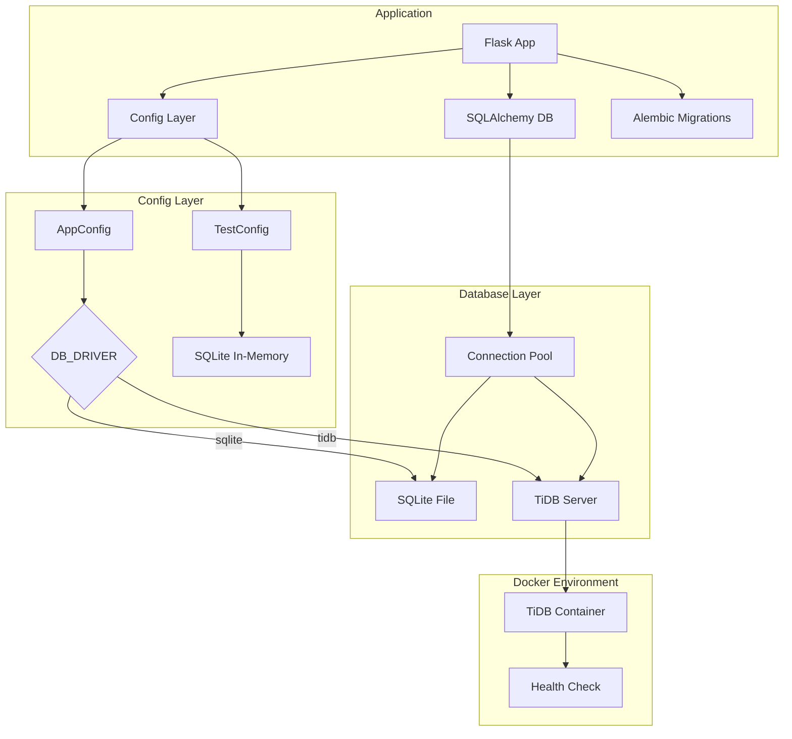
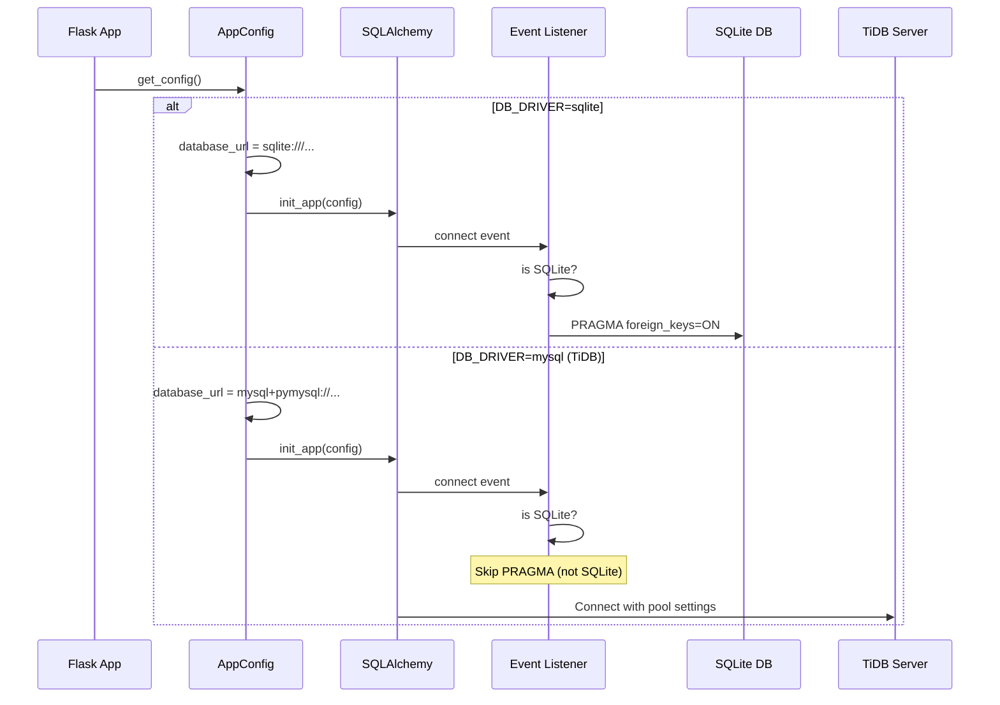
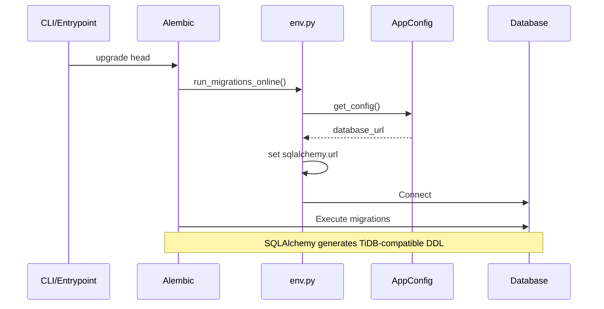
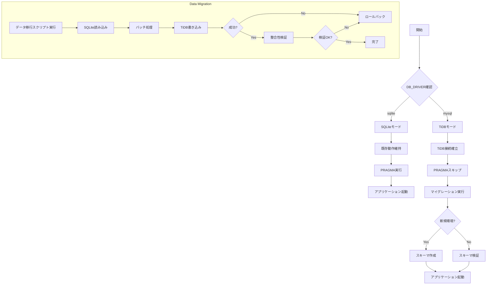

# Technical Design Document

## Overview

**Purpose**: 本機能は、サブスクリプション管理バックエンドAPIのデータベースをSQLiteからTiDBへ移行し、スケーラビリティと可用性を向上させる。

**Users**: 開発者（ローカル開発・本番デプロイ）、運用者（データ移行・監視）

**Impact**: 現在のSQLite単一構成から、TiDB（MySQL互換）への接続切り替え機能を追加。環境変数による柔軟なデータベース選択を可能にし、既存のSQLiteサポートを維持しつつTiDB環境への移行パスを提供。

### Goals

- 環境変数によるSQLite/TiDB切り替え機能の実装
- 既存のSQLite固有コードの条件分岐化
- TiDB環境でのマイグレーション実行のサポート
- Docker環境でのTiDB起動・接続検証
- データ移行スクリプトの提供

### Non-Goals

- 本番環境の完全移行（この設計は移行機能の実装に留まる）
- パフォーマンスチューニング（移行後の別タスクとして扱う）
- レプリケーション・バックアップ設定の変更
- マルチリージョン構成

## Architecture

### Existing Architecture Analysis

現在のアーキテクチャ:

- **3層アーキテクチャ**: API層 → Service層 → Repository層
- **データベース**: SQLite（開発・本番）、インメモリSQLite（テスト）
- **ORM**: SQLAlchemy 2.0 + Flask-SQLAlchemy 3.1
- **マイグレーション**: Alembic 1.16
- **設定管理**: pydantic-settings による環境変数読み込み

**変更が必要な領域**:

1. `app/config.py`: TiDB接続設定の追加
2. `app/models/__init__.py`: SQLite PRAGMAの条件分岐化
3. Docker構成: 既存のTiDBサービス活用
4. テスト構成: TiDB対応テスト設定の追加

### Architecture Pattern & Boundary Map



**Architecture Integration**:

- **Selected pattern**: Environment-based database driver selection (既存パターンの拡張)
- **Domain/feature boundaries**:
  - Config層: データベース接続設定の集約
  - Models層: データベース固有設定の条件分岐
  - Infrastructure層: Docker環境でのTiDB起動
- **Existing patterns preserved**: Layered architecture, Repository pattern, Dependency injection
- **New components rationale**:
  - TiDB接続設定: 既存のmysqlドライバーを活用（TiDBはMySQL 8.0プロトコル互換のため`DB_DRIVER=mysql`で対応）
- **Steering compliance**: 既存の3層アーキテクチャと設定管理パターンに準拠

### Technology Stack

| Layer | Choice / Version | Role in Feature | Notes |
|-------|------------------|-----------------|-------|
| Backend / Services | Python 3.13 / Flask 3.1 | アプリケーション実行環境 | 変更なし |
| Data / Storage | TiDB (MySQL 8.0 protocol) | 新規データベースターゲット | Docker環境で既に構成済み |
| Data / Storage | SQLite | 従来のデータベース | サポート継続 |
| ORM | SQLAlchemy 2.0.40 | データベース抽象化 | 変更なし |
| Migrations | Alembic 1.16.1 | スキーマ管理 | dialect自動選択 |
| Driver | pymysql 1.1.0 | MySQL/TiDB接続ドライバ | 既に依存関係に追加済み |
| Infrastructure | Docker Compose | ローカル開発環境 | TiDBサービス追加済み |

## System Flows

### データベース接続フロー



### マイグレーション実行フロー



## Requirements Traceability

| Requirement | Summary | Components | Interfaces | Flows |
|-------------|---------|------------|------------|-------|
| 1.1 | MySQL互換(TiDB)接続URL生成 | AppConfig.database_url | database_url property | DB接続フロー |
| 1.2 | SQLite接続URL生成 | AppConfig.database_url | database_url property | DB接続フロー |
| 1.3 | mysql+pymysqlドライバー使用 | AppConfig.database_url | Connection string | DB接続フロー |
| 1.4 | 環境変数からTiDB接続情報読み込み | AppConfig | Field definitions | 設定読み込み |
| 1.5 | 必須情報欠落時のエラー | AppConfig.validate_db_dependencies | model_validator | 設定検証 |
| 2.1 | SQLite以外でPRAGMA実行回避 | set_sqlite_pragma | Event listener | DB接続フロー |
| 2.2 | ドライバー別設定適用 | AppConfig.to_flask_config | Engine options | DB接続フロー |
| 2.3 | ドライバー判定ユーティリティ | 既存のisinstanceチェック | SQLiteConnection | DB接続フロー |
| 3.1 | TiDB互換データ型使用 | SQLAlchemy Models | Column types | - |
| 3.2 | 複合主キーサポート | ExchangeRate | Primary key | - |
| 3.3 | 外部キー制約サポート | All models with FK | ForeignKey | - |
| 3.4 | インデックス定義サポート | All indexed models | Index | - |
| 4.1 | Alembic環境変数読み込み | migrations/env.py | DATABASE_URL | マイグレーションフロー |
| 4.2 | TiDB互換DDL生成 | SQLAlchemy + Alembic | MySQL dialect | マイグレーションフロー |
| 4.3 | データ保持スキーマ更新 | Alembic migrations | Migrations | - |
| 4.4 | マイグレーションロールバック | Alembic | downgrade() | - |
| 5.1 | テスト用DB設定 | TestConfig | Fields | テスト実行 |
| 5.2 | 統合テスト用TiDB/インメモリDB | TestConfig.database_url | database_url property | テスト実行 |
| 5.3 | テスト後DBクリーンアップ | conftest.py | clean_database fixture | テスト実行 |
| 5.4 | テスト間DB状態分離 | conftest.py | db_session fixture | テスト実行 |
| 6.1 | Docker ComposeでTiDB起動 | compose.yml | tidb service | Docker起動 |
| 6.2 | ヘルスチェック待機 | compose.yml | healthcheck | Docker起動 |
| 6.3 | API起動時TiDB接続確認 | backend-api depends_on | healthcheck | Docker起動 |
| 6.4 | TiDBデータ永続ボリューム | compose.yml | tidb-data volume | Docker起動 |
| 7.1 | 適切な接続プールサイズ | AppConfig.to_flask_config | pool_size | DB接続フロー |
| 7.2 | アイドル接続管理 | AppConfig.to_flask_config | pool_recycle | DB接続フロー |
| 7.3 | 再接続試行 | SQLAlchemy | pool_pre_ping | DB接続フロー |
| 7.4 | pool_pre_ping有効化 | AppConfig.to_flask_config | pool_pre_ping | DB接続フロー |
| 8.1 | SQLite→TiDBデータ転送 | Migration Script | Export/Import | データ移行 |
| 8.2 | データ整合性検証 | Migration Script | Validation | データ移行 |
| 8.3 | 移行エラー時ロールバック | Migration Script | Transaction | データ移行 |
| 8.4 | 移行進捗ログ | Migration Script | Logging | データ移行 |

## Components and Interfaces

### Component Summary

| Component | Domain/Layer | Intent | Req Coverage | Key Dependencies | Contracts |
|-----------|--------------|--------|--------------|------------------|-----------|
| AppConfig | Config | データベース接続設定管理 | 1.1-1.5, 7.1-7.4 | pydantic-settings (P0) | Service |
| TestConfig | Config | テスト環境用DB設定 | 5.1-5.2 | AppConfig (P1) | Service |
| set_sqlite_pragma | Models | SQLite PRAGMA条件実行（既存） | 2.1-2.2 | SQLite Connection (P0) | Event |
| Migration Script | Scripts | SQLite→TiDBデータ移行 | 8.1-8.4 | SQLAlchemy (P0), AppConfig (P0) | Batch |
| TiDB Health Check | Docker | TiDBコンテナ状態監視 | 6.2-6.3 | Docker (External) | Infrastructure |

### Config Layer

#### AppConfig

| Field | Detail |
|-------|--------|
| Intent | 環境変数からデータベース接続設定を読み込み、SQLite/TiDB両対応の接続URLを生成する |
| Requirements | 1.1, 1.2, 1.3, 1.4, 1.5, 7.1, 7.2, 7.4 |
| Owner / Reviewers | Backend Team |

**Responsibilities & Constraints**

- 環境変数からDB_DRIVERを読み込み、sqlite/tidbを判別
- 各ドライバーに応じた接続URLを生成
- TiDB接続時に必要な環境変数が設定されているか検証
- TiDB接続時に適切な接続プール設定を提供

**Dependencies**

- Inbound: Flask Application — 設定読み込み (P0)
- Outbound: pydantic-settings — 環境変数解析 (P0)
- Outbound: SQLAlchemy — 接続URL提供 (P0)

**Contracts**: Service [x] / API [ ] / Event [ ] / Batch [ ] / State [ ]

##### Service Interface

```python
class AppConfig(BaseSettings):
    DB_DRIVER: str  # "sqlite" | "mysql" (TiDBはmysqlを使用)
    DB_HOST: str
    DB_PORT: int
    DB_NAME: str
    DB_USER: str
    DB_PASSWORD: str | None

    @property
    def database_url(self) -> str:
        """Generate database URL based on DB_DRIVER."""
        ...

    def to_flask_config(self) -> dict:
        """Convert to Flask configuration format with pool settings."""
        ...

    @model_validator(mode="after")
    def validate_db_dependencies(self) -> Self:
        """Validate required fields for mysql driver."""
        ...
```

- **Preconditions**:
  - `DB_DRIVER` is either "sqlite" or "mysql"
  - For mysql (TiDB): `DB_HOST`, `DB_PORT`, `DB_USER`, `DB_PASSWORD`, `DB_NAME` must be set
- **Postconditions**:
  - `database_url` returns valid connection string
  - `to_flask_config()` returns complete Flask config dict
- **Invariants**:
  - Connection URL format matches selected driver
  - Pool settings are appropriate for selected driver

**Implementation Notes**

- Integration: 既存の `mysql` ドライバー設定を活用（TiDBはMySQL 8.0プロトコル互換）
- Validation: `validate_db_dependencies` は既存のmysqlバリデーションで対応済み
- Risks: 接続プール設定がTiDB分散構成に適していることを確認

#### TestConfig

| Field | Detail |
|-------|--------|
| Intent | テスト環境用のデータベース設定を提供し、SQLite/TiDB両対応のテスト実行を可能にする |
| Requirements | 5.1, 5.2 |
| Owner / Reviewers | Backend Team |

**Responsibilities & Constraints**

- デフォルトでSQLiteインメモリDBを使用（高速なユニットテスト）
- 環境変数によりTiDBテスト設定を可能にする
- テスト環境の安全性を保証（本番設定の混入防止）

**Dependencies**

- Inbound: pytest fixtures — 設定読み込み (P0)
- Outbound: AppConfig — 設定継承 (P1)

**Contracts**: Service [x] / API [ ] / Event [ ] / Batch [ ] / State [ ]

##### Service Interface

```python
class TestConfig(BaseSettings):
    DB_DRIVER: str = "sqlite"  # Default to SQLite for fast tests
    DB_NAME: str = ":memory:"  # In-memory SQLite

    @property
    def database_url(self) -> str:
        """Generate test database URL."""
        ...
```

- **Preconditions**: `TESTING` environment variable or testing=True parameter
- **Postconditions**: Returns test-appropriate database configuration
- **Invariants**: Never connects to production database

**Implementation Notes**

- Integration: Add optional TiDB test configuration via `TEST_DB_DRIVER` environment variable
- Validation: Ensure test safety checks remain intact
- Risks: Maintain backward compatibility with existing test suite

### Models Layer

#### set_sqlite_pragma (Existing Event Listener - No Changes Required)

| Field | Detail |
|-------|--------|
| Intent | SQLite接続時のみ外部キー制約を有効化するPRAGMAを実行 |
| Requirements | 2.1, 2.2 |
| Owner / Reviewers | Backend Team |

**Responsibilities & Constraints**

- SQLite接続の場合のみPRAGMAを実行
- TiDB/MySQL接続の場合はPRAGMAをスキップ
- 接続イベントリスナーとして動作

**Dependencies**

- Inbound: SQLAlchemy Engine — connect event (P0)
- External: SQLite Connection — PRAGMA execution (P0)

**Contracts**: Service [ ] / API [ ] / Event [x] / Batch [ ] / State [ ]

##### Event Contract

- **Published events**: None
- **Subscribed events**: `Engine.connect`
- **Ordering / delivery guarantees**: N/A (synchronous event)

**Implementation Notes**

- Integration: 既存の `isinstance(dbapi_connection, SQLiteConnection)` チェックが正しく動作するため変更不要
- Validation: 既存のユニットテストでPRAGMAの条件分岐が検証済み
- Risks: なし（既存実装が正しいアプローチを採用）

### Scripts Layer

#### Data Migration Script (New)

| Field | Detail |
|-------|--------|
| Intent | 既存のSQLiteデータをTiDBへ移行するバッチスクリプト |
| Requirements | 8.1, 8.2, 8.3, 8.4 |
| Owner / Reviewers | Backend Team / DevOps |

**Responsibilities & Constraints**

- 全テーブルデータをSQLiteからTiDBへ転送
- データ整合性の検証
- エラー時のロールバック
- 進捗ログの出力

**Dependencies**

- Inbound: CLI / Manual execution — migration trigger (P0)
- Outbound: SQLite — source data read (P0)
- Outbound: TiDB — destination data write (P0)
- Outbound: SQLAlchemy — model access (P0)

**Contracts**: Service [ ] / API [ ] / Event [ ] / Batch [x] / State [ ]

##### Batch / Job Contract

- **Trigger**: Manual execution via `python scripts/migrate_data.py`
- **Input / validation**: Source SQLite path, destination TiDB connection
- **Output / destination**: TiDB database tables
- **Idempotency & recovery**: Supports resume from checkpoint; validates before commit

**Implementation Notes**

- Integration: Use SQLAlchemy models for data access; transaction-based migration
- Validation: Row count comparison, foreign key integrity check
- Risks: Large data volumes may require batch processing; network failures during migration

### Infrastructure Layer

#### TiDB Docker Service

| Field | Detail |
|-------|--------|
| Intent | ローカル開発環境でTiDBコンテナを起動・管理 |
| Requirements | 6.1, 6.2, 6.3, 6.4 |
| Owner / Reviewers | DevOps Team |

**Responsibilities & Constraints**

- TiDBコンテナの正常起動
- ヘルスチェックによる準備完了待機
- データ永続ボリュームの提供

**Dependencies**

- Inbound: Docker Compose — container orchestration (P0)
- External: pingcap/tidb image — TiDB server (P0)

**Contracts**: Service [ ] / API [ ] / Event [ ] / Batch [ ] / State [x]

##### State Management

- **State model**: Container running → healthy → ready
- **Persistence & consistency**: Docker volume for data persistence
- **Concurrency strategy**: Single container (development)

**Implementation Notes**

- Integration: Already configured in compose.yml; verify health check works correctly
- Validation: Ensure backend-api depends_on with condition: service_healthy
- Risks: Container startup time may require increased health check retries

## Data Models

### Domain Model

**Aggregates and Transactional Boundaries**:

- **User Aggregate**: User (root) → Subscriptions, Labels, PaymentHistories
- **Subscription Aggregate**: Subscription (root) → Labels (via subscription_labels)
- **ExchangeRate Aggregate**: ExchangeRate (standalone, composite key)

**Entities**: User, Subscription, Label, ExchangeRate, PaymentHistory

**Value Objects**: None (all models have identity)

**Business Rules & Invariants**:

- User must have unique username and email
- Subscription must belong to a User
- ExchangeRate has composite key (from_currency, to_currency, date)
- PaymentHistory references ExchangeRate via foreign key

**Model Compatibility Note**: All existing models are TiDB-compatible through SQLAlchemy abstraction. No model changes required.

### Logical Data Model

**Entity Relationships and Cardinality**:

```
User (1) ←→ (N) Subscription
User (1) ←→ (N) Label
User (1) ←→ (N) PaymentHistory
Subscription (N) ←→ (M) Label (via subscription_labels)
Subscription (1) ←→ (N) PaymentHistory
PaymentHistory (N) ←→ (1) ExchangeRate (FK to composite key)
Label (1) ←→ (N) Label (self-referential parent-child)
```

**Consistency & Integrity**:

- **Transaction boundaries**: User operations span User + related entities
- **Cascading rules**:
  - User DELETE CASCADE to Subscriptions, Labels, PaymentHistories
  - Subscription DELETE CASCADE to subscription_labels
  - Subscription DELETE SET NULL on PaymentHistory.subscription_id
  - Label DELETE CASCADE to children Labels
- **Temporal aspects**: created_at, updated_at on all tables

### Physical Data Model

**TiDB-Specific Considerations**:

- **Table definitions**: All SQLAlchemy types map correctly to TiDB
  - Integer → INT
  - String(n) → VARCHAR(n)
  - REAL → DOUBLE
  - Date → DATE
  - DateTime → DATETIME
  - Boolean → TINYINT(1)

- **Primary/Foreign keys**:
  - All single-column PKs use AUTO_INCREMENT
  - ExchangeRate uses composite PK (from_currency, to_currency, date)
  - Foreign keys with ON DELETE CASCADE/SET NULL supported

- **Indexes**: All defined indexes in models are TiDB-compatible
  - Single-column indexes
  - Composite indexes (idx_subscriptions_user_status, etc.)

- **Partitioning**: Not required for current scale (future consideration)

## Error Handling

### Error Strategy

エラーは接続レイヤーとデータ移行レイヤーで異なる戦略を採用。

### Error Categories and Responses

**Connection Errors**:
- **Missing required TiDB config (4xx)**: Clear error message indicating which field is missing
- **Connection failure (5xx)**: Retry with exponential backoff; log detailed error
- **Pool exhaustion (5xx)**: Log warning; return service unavailable

**Migration Errors**:
- **Data type mismatch**: Convert with logging; continue migration
- **Foreign key violation**: Rollback transaction; report affected tables
- **Network interruption**: Checkpoint-based resume; log last successful batch

### Monitoring

- Connection pool metrics: active connections, wait time
- Migration progress: row counts per table, elapsed time
- Error rate: connection failures, query errors

## Testing Strategy

### Unit Tests

- `test_config_database_url_sqlite`: SQLite接続URL生成の検証
- `test_config_database_url_mysql`: MySQL互換(TiDB)接続URL生成の検証
- `test_config_validate_mysql_dependencies`: 必須項目検証のテスト
- `test_pragma_conditional_execution`: PRAGMA条件分岐のテスト（既存実装の確認）

### Integration Tests

- `test_tidb_connection`: TiDBコンテナへの接続確認
- `test_migration_tidb`: マイグレーションのTiDB実行
- `test_crud_operations_tidb`: TiDBでのCRUD操作検証
- `test_foreign_key_constraints_tidb`: 外部キー制約の動作確認
- `test_transaction_behavior_tidb`: トランザクション分離レベル確認

### E2E/UI Tests

- N/A (バックエンドAPIのため、APIテストで代替)

### Performance/Load

- `test_connection_pool_under_load`: 接続プールの負荷テスト
- `test_concurrent_queries_tidb`: 並行クエリパフォーマンス
- `test_migration_large_dataset`: 大量データ移行のパフォーマンス

## Migration Strategy



**Phase breakdown**:

1. **Phase 1: Configuration Setup**
   - Add TiDB driver support to config
   - Implement conditional PRAGMA
   - Test with SQLite (backward compatibility)

2. **Phase 2: Docker Environment**
   - Verify TiDB container startup
   - Validate health check
   - Test backend-api dependency

3. **Phase 3: Migration Testing**
   - Run Alembic migrations against TiDB
   - Validate schema creation
   - Test CRUD operations

4. **Phase 4: Data Migration**
   - Execute migration script
   - Validate data integrity
   - Rollback if validation fails

**Rollback triggers**:

- Schema creation failure
- Data integrity validation failure
- Critical application errors after migration

**Validation checkpoints**:

- Schema matches expected structure
- Row counts match source
- Foreign key relationships intact
- Application functionality verified
