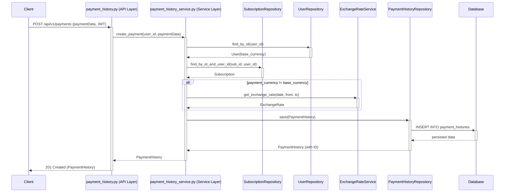

# 技術設計書: 支払履歴登録API

## 1. 概要
本ドキュメントは、ユーザーが支払い履歴を登録するためのAPI（`payment-history-registration-api`）の技術設計を定義します。要求仕様書で定義された「WHAT」を、具体的な実装方法である「HOW」に変換することを目的とします。

### 1.1. ゴール
- 認証されたユーザーが、自身のサブスクリプションに対する支払い履歴を登録できるAPIエンドポイントを提供する。
- 支払い通貨がユーザーの基本通貨と異なる場合、該当する為替レート情報を取得し、支払い履歴と共に保存する。
- 既存のアーキテクチャと設計パターンを遵守し、一貫性と保守性の高い実装を実現する。

### 1.2. 対象外の項目
- 登録された支払い履歴の編集・削除機能（これらは別の仕様で管理）。
- フロントエンドのUI実装。

## 2. アーキテクチャ

### 2.1. 既存アーキテクチャの分析
本プロジェクトは、Flaskを使用した3層アーキテクチャ（API層、サービス層、リポジトリ層）を採用しています。本機能はこの既存パターンを拡張する形で実装します。ドメインの境界、依存性注入（DI）のパターン、標準的なエラーハンドリングといった既存の仕組みを尊重し、そのまま利用します。

### 2.2. アーキテクチャパターンと境界マップ
本機能は既存のアーキテクチャを拡張するため、大きな変更はありません。主要な処理はシーケンス図に示す通り、API層、サービス層、リポジトリ層の間で明確に役割分担されます。



### 2.3. 技術スタック
既存の技術スタックに変更はありません。
| Layer | Choice / Version | Role in Feature |
|---|---|---|
| Backend | Python 3.13, Flask, SQLAlchemy | ビジネスロジックとAPIエンドポイントの実装 |
| Data | SQLite | 支払い履歴データの永続化 |

## 3. コンポーネントとインターフェース

### 3.1. app.api.v1.payment_history.py
`GET`処理が実装されている既存のファイルに、支払い履歴を作成するための`POST`ルートを追加します。

#### `create_payment()`
| Field | Detail |
|---|---|
| Intent | HTTPリクエストを受け取り、検証し、サービス層に処理を委譲する |
| Requirements | 1.1, 1.2, 1.3, 1.4, 1.5, 1.6 |

**API Contract**
| Method | Endpoint | Request Body | Response | Errors |
|---|---|---|---|---|
| POST | /api/v1/payments | `PaymentCreateRequest` スキーマ | 201: `Payment` | 400, 401, 403, 404 |

`PaymentCreateRequest` はOpenAPI定義に準拠し、`subscription_id`, `amount`, `currency`, `payment_date`, `payment_method`を含みます。

### 3.2. app.services.payment_history_service.py
既存のサービスクラスを拡張し、支払い履歴作成のビジネスロジックを実装します。

#### コンストラクタ `__init__`
依存性注入パターンに従い、コンストラクタを拡張して`SubscriptionRepository`, `UserRepository`, `ExchangeRateService`を受け取れるように修正します。

```python
# app/services/payment_history_service.py

class PaymentHistoryService:
    def __init__(
        self,
        session: Session,
        payment_history_repository: PaymentHistoryRepository | None = None,
        subscription_repository: SubscriptionRepository | None = None,
        user_repository: UserRepository | None = None,
        exchange_rate_service: ExchangeRateService | None = None,
    ) -> None:
        self.session = session
        self.payment_history_repository = payment_history_repository or PaymentHistoryRepository(session)
        self.subscription_repository = subscription_repository or SubscriptionRepository(session)
        self.user_repository = user_repository or UserRepository(session)
        self.exchange_rate_service = exchange_rate_service or ExchangeRateService(
            exchange_rate_repository=ExchangeRateRepository(session)
        )
        # ...
```

#### `create_payment()`
| Field | Detail |
|---|---|
| Intent | 支払い履歴の作成に関するビジネスロジックをすべて実行する |
| Requirements | 2.1, 2.2, 2.3, 2.4, 3.1, 3.2, 3.3, 3.4 |

**Service Interface**
```python
# app/services/payment_history_service.py

from app.models.payment_history import PaymentHistory

# ...
class PaymentHistoryService:
    # ...
    def create_payment(self, user_id: int, payment_data: dict) -> PaymentHistory:
        """
        新しい支払い履歴を作成し、DBに保存する

        Args:
            user_id: 支払いを行うユーザーのID
            payment_data: APIリクエストから受け取った支払いデータ

        Returns:
            作成されたPaymentHistoryオブジェクト

        Raises:
            ResourceNotFoundError: サブスクリプションが存在しない場合
            ForbiddenError: サブスクリプションがユーザーのものでない場合
            ValidationError: 為替レートが見つからないなど、ビジネスルール違反の場合
        """
        # 1. ユーザーとサブスクリプションの存在・権限チェック
        # 2. 為替レートの取得と保存情報の準備（通貨が異なる場合）
        # 3. PaymentHistoryモデルインスタンスの生成
        # 4. リポジトリを介した永続化
        pass
```

## 4. データモデル
既存の `PaymentHistory`, `User`, `Subscription`, `ExchangeRate` モデルを使用します。今回の機能追加に伴うスキーマの変更はありません。

## 5. エラーハンドリング
アプリケーション共通のエラーハンドリング機構を利用します。サービス層で発生したビジネス例外は、`app/common/error_handlers.py` に定義されたハンドラによって適切なHTTPレスポンスに変換されます。

| エラー | 発生源 (サービス層) | APIレスポンス |
|---|---|---|
| `ValidationError` | リクエストデータの形式が不正 | 400 Bad Request |
| `ResourceNotFoundError` | `subscription_id` が存在しない | 404 Not Found |
| `ForbiddenError` | `subscription_id` が他ユーザーのもの | 403 Forbidden |
| `ValidationError` | 該当する為替レートが見つからない | 400 Bad Request |

## 6. テスト戦略
- **単体テスト (Unit Tests)**:
    - `PaymentHistoryService.create_payment` メソッドのテスト。
        - 正常系（基本通貨と同じ、異なる通貨）
        - 異常系（サブスクリプションが見つからない、権限がない、為替レートがない）
    - 各リポジトリのメソッドはモック化する。
- **結合テスト (Integration Tests)**:
    - `POST /api/v1/payments` エンドポイントのテスト。
    - データベースを実際に使用し、リクエストからレスポンスまで一貫した動作を検証する。
    - 有効なJWTトークン、無効なトークン、必須項目不足など、様々なリクエストパターンを網羅する。
