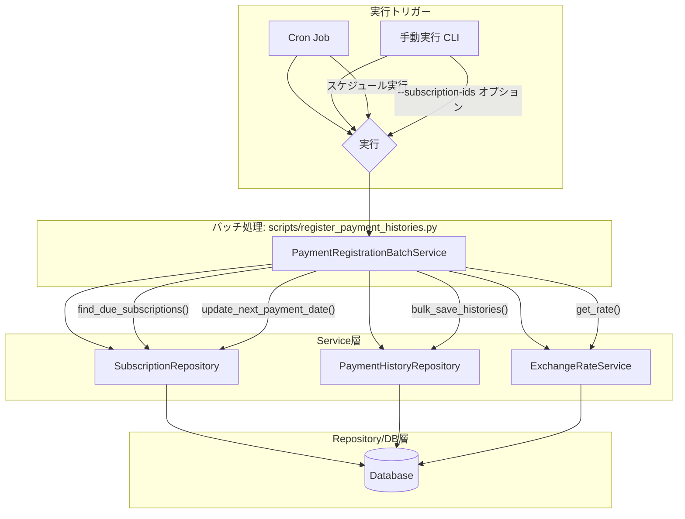
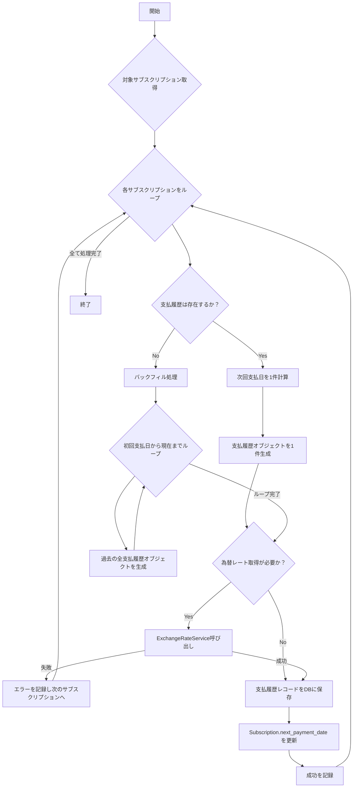

# 技術設計書: 支払履歴登録バッチ

## 1. 概要

**目的**: 本機能は、ユーザーが登録したサブスクリプション情報に基づき、定期的な支払い履歴を自動で生成するバッチ処理を実装します。これにより、手動での入力ミスや記録漏れを防ぎ、データの正確性と網羅性を保証します。

**ユーザー**: 本システムの全ユーザーが対象です。バッチ処理はバックグラウンドで実行されるため、直接的なユーザー操作はありませんが、生成された支払い履歴はアプリケーション上で確認できます。

### 1.1. ゴール
- アクティブなサブスクリプションに対し、支払い期日に基づいて自動で支払い履歴レコードを作成する。
- 新規に登録されたサブスクリプションに対し、初回支払日から現在までの未記録の支払い履歴をすべて遡って登録（バックフィル）する。
- 定期実行（日次）および、特定のサブスクリプションを対象とした手動実行の両方をサポートする。
- 処理の成功、失敗、スキップなどの結果を詳細にロギングし、運用者が追跡できるようにする。

### 1.2. ノンゴール
- ユーザーへの通知機能（例: 登録完了通知）はこの機能の範囲外とする。
- 支払い処理そのもの（決済ゲートウェイとの連携など）は行わない。あくまで履歴の記録のみを目的とする。

## 2. アーキテクチャ

### 2.1. 既存アーキテクチャの分析
本プロジェクトは、Flaskで構築された3層アーキテクチャ（API層、Service層、Repository層）を採用しています。新しいバッチ処理もこのアーキテクチャを踏襲し、既存のコンポーネント（Service、Repository）を再利用・拡張することで、一貫性を保ちます。具体的には、`scripts/`ディレクトリに配置されたPythonスクリプトがエントリーポイントとなり、Flaskのアプリケーションコンテキスト内でService層を呼び出す既存のバッチ処理パターン（`fetch_exchange_rates.py`）に倣います。

### 2.2. 高レベルアーキテクチャ



**アーキテクチャ統合**:
- **既存パターンの維持**: Service層がビジネスロジックを担当し、Repository層がデータアクセスを担当するという既存の関心事の分離を維持します。
- **新規コンポーネントの論理**: バッチ処理固有の複雑なビジネスロジック（日付計算、バックフィル）をカプセル化するため、`PaymentRegistrationBatchService`を新設します。エントリーポイントとして`register_payment_histories.py`を`scripts`ディレクトリに配置します。
- **技術スタック整合性**: 既存のPython, Flask, SQLAlchemyスタックに準拠し、新たな外部ライブラリの導入は最小限（日付計算のための`python-dateutil`など標準的なもの）に留めます。

## 3. システムフロー

バッチ処理の中核となる`PaymentRegistrationBatchService`のロジックフローを以下に示します。



## 4. コンポーネントとインターフェース

### 4.1. `scripts` 層

#### `register_payment_histories.py`
- **責務**: バッチ処理の起動、コマンドライン引数の解析、アプリケーションコンテキストのセットアップ、および`PaymentRegistrationBatchService`の呼び出しを担当します。
- **バッチ/ジョブ契約**:
  - **トリガー**: Cronによるスケジュール実行、または開発者による手動実行。
  - **入力**: オプションの`--subscription-ids`引数（カンマ区切りのIDリスト）。指定された場合、対象をそのIDのみに限定する。
  - **出力**: 標準出力へのログ（INFO, ERRORレベル）。
  - **冪等性**: スクリプト自体は状態を持たず、呼び出すサービスが冪等性を担保します。

### 4.2. `services` 層

#### `PaymentRegistrationBatchService` (新規)
- **責務**: 支払い履歴登録のコアビジネスロジックをすべて担当します。対象の特定、日付計算、バックフィル、為替レート取得、および`Subscription`の次回支払日更新のオーケストレーションを行います。
- **トランザクション管理**: 1つのサブスクリプションに対する処理（`PaymentHistory`の作成と`Subscription`の更新）は、不可分な単一のデータベーストランザクション内で実行されなければなりません。処理の途中でエラーが発生した場合は、そのサブスクリプションに関するすべての変更をロールバックし、データの整合性を保証します。
- **依存関係**:
  - **アウトバウンド**: `SubscriptionRepository`, `PaymentHistoryRepository`, `ExchangeRateService`
- **サービスインターフェース**:
  ```python
  # Result型は成功/失敗を表現するカスタム型とする
  from app.common.result import Result

  class BatchSummary:
      processed: int
      success: int
      failed: int

  class PaymentRegistrationBatchService:
      def execute(self, subscription_ids: list[int] | None = None) -> Result[BatchSummary, Exception]:
          """バッチ処理を実行する"""
          pass
  ```

### 4.3. `repositories` 層

#### `SubscriptionRepository` (既存拡張)
- **責務**: サブスクリプションモデルに関する永続化ロジック。
- **統合戦略**: 既存クラスに新しいメソッドを追加します。
- **インターフェース (追加分)**:
  ```python
  from app.models.subscription import Subscription

  class SubscriptionRepository:
      def find_due_subscriptions(self, target_date: date) -> list[Subscription]:
          """指定日時点で支払期日を迎えているアクティブなサブスクリプションを検索する。
          具体的には、ステータスが 'active' であり、かつ以下のいずれかの条件を満たすものを対象とする：
          1. `next_payment_date` が `target_date` 以前である。
          2. `next_payment_date` が `NULL` であり、かつ `initial_payment_date` が `target_date` 以前である。
          """
          pass

      def update_next_payment_date(self, subscription: Subscription, new_date: date) -> None:
          """指定されたサブスクリプションの次回支払日を更新する"""
          pass
  ```

#### `PaymentHistoryRepository` (既存拡張)
- **責務**: 支払い履歴モデルに関する永続化ロジック。
- **統合戦略**: 既存クラスに新しいメソッドを追加します。
- **インターフェース (追加分)**:
  ```python
  from app.models.payment_history import PaymentHistory

  class PaymentHistoryRepository:
      def bulk_save(self, histories: list[PaymentHistory]) -> None:
          """複数の支払履歴レコードを一括で保存する"""
          # SQLAlchemyの bulk_save_objects を使用
          pass
  ```

## 5. データモデル

この機能の実装に伴い、`Subscription`モデルを拡張する必要があります。

### `Subscription` モデル (拡張)
- **変更点**: `next_payment_date`フィールドを追加します。このフィールドは、バッチ処理が次に支払い履歴を生成すべき日付を保持します。これにより、処理対象のサブスクリプションを効率的に特定できます。
- **追加フィールド**:
  ```python
  class Subscription(db.Model):
      # ... 既存のフィールド ...
      next_payment_date: Mapped[date] = mapped_column(Date, nullable=True, index=True)
  ```
- **マイグレーション**: この変更をデータベースに適用するため、新しいAlembicマイグレーションスクリプトの生成が必要となります。

## 6. エラーハンドリング

- **戦略**: バッチ処理は堅牢でなければならず、一部のデータに問題があっても可能な限り処理を続行します。致命的なエラーが発生した場合のみ処理を中断します。
- **エラーカテゴリ**:
  - **致命的エラー**: データベース接続不可など。即座に処理を中断し、クリティカルレベルのログを出力して異常終了します。
  - **個別エラー**: 特定のサブスクリプションに関するエラー（例: 為替レート取得失敗）。エラーをログに記録し、そのサブスクリプションの処理をスキップして次の処理へ進みます。
  - **データ不整合**: `payment_frequency`が不正など。エラーをログに記録し、スキップします。

## 7. テスト戦略

- **単体テスト**:
  - `PaymentRegistrationBatchService`内の日付計算ロジック（特にバックフィルと次回支払日計算）を、様々な`payment_frequency`と`initial_payment_date`の組み合わせで網羅的にテストします。
  - 為替レート取得失敗時のスキップロジックをテストします。
  - Repositoryや外部Serviceはモック化します。
- **統合テスト**:
  - `register_payment_histories.py`スクリプト全体を対象とします。
  - インメモリSQLiteデータベースを使用し、テスト用の`Subscription`データを準備します。
  - バックフィルが正しく機能し、期待される数の`PaymentHistory`レコードが生成されることを検証します。
  - 特定IDを指定した手動実行が正しく機能することを検証します。
  - エラーケース（為替レートがない場合など）で、対象のレコードがスキップされ、他のレコードは正しく処理されることを検証します。
