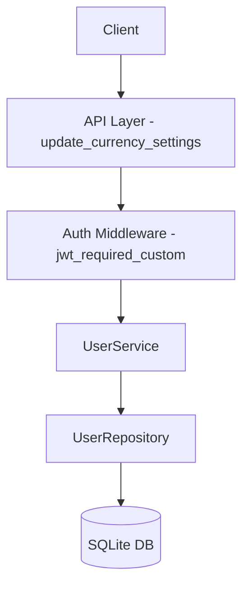

# 設計ドキュメント

## Overview

本機能は、認証済みユーザーが自分の通貨設定（基準通貨）を更新するためのAPI `PATCH /users/{userId}/settings/currency` を提供する。

**Purpose**: ユーザーがサブスクリプション管理における基準通貨設定を変更できるようにする。
**Users**: 認証済みユーザーが自身の設定変更に利用する。
**Impact**: 新規エンドポイントの追加のみ。既存機能への変更なし。

### Goals
- ユーザーの基準通貨設定を更新するAPIを提供
- 既存の認証・認可パターンに従う
- OpenAPI仕様書との整合性を保つ

### Non-Goals
- 他のユーザー設定の更新
- 通貨設定の削除（デフォルト値へのリセットは別途検討）
- EUR、GBPのサポート（現在はUSD、JPYのみ）

## Architecture

### Existing Architecture Analysis
- **Current Pattern**: Layered Architecture (API → Service → Repository)
- **Existing Components**: `user_bp` Blueprint, `UserService`, `UserRepository`
- **Integration Points**: `app/api/v1/user.py`に新規エンドポイント追加
- **Technical Debt**: `UserService.VALID_CURRENCIES` と `CurrencyConstants` の不整合（本機能では `CurrencyConstants` を使用）

### Architecture Pattern & Boundary Map



**Architecture Integration**:
- Selected pattern: Layered Architecture（既存パターン継承）
- Domain/feature boundaries: ユーザー設定ドメインの一部
- Existing patterns preserved: `jwt_required_custom`, `success_response`, `UserService`
- New components rationale: 新規コンポーネント不要、既存 `UserService` を活用
- Steering compliance: 3層アーキテクチャ、Blueprintベースのルーティング

### Technology Stack

| Layer | Choice / Version | Role in Feature | Notes |
|-------|------------------|-----------------|-------|
| Backend / Services | Flask 3.1.0 | API Framework | 既存 |
| Data / Storage | SQLite + SQLAlchemy 2.0 | ORM | 既存 User.base_currency |

## Requirements Traceability

| Requirement | Summary | Components | Interfaces | Flows |
|-------------|---------|------------|------------|-------|
| 1.1 | JWT認証済みリクエストの処理 | user_bp, auth_middleware | jwt_required_custom | - |
| 1.2 | JWTトークン不在時の401エラー | auth_middleware | jwt_required_custom | - |
| 1.3 | JWTトークン期限切れ時の401エラー | auth_middleware | jwt_required_custom | - |
| 1.4 | ユーザーID不一致時の403エラー | user_bp | update_currency_settings | - |
| 2.1 | JSON形式リクエストボディ検証 | user_bp | update_currency_settings | - |
| 2.2 | base_currency必須フィールド検証 | user_bp | update_currency_settings | - |
| 2.3 | base_currency空文字検証 | user_bp | update_currency_settings | - |
| 2.4 | ISO 4217形式検証 | user_bp | update_currency_settings | - |
| 2.5 | サポート対象通貨検証 | user_bp, CurrencyConstants | update_currency_settings | - |
| 3.1 | ユーザー通貨設定の更新 | user_bp, UserService | update_currency_settings | - |
| 3.2 | ユーザー不在時の404エラー | user_bp | update_currency_settings | - |
| 3.3 | 更新後のbase_currency返却 | user_bp | update_currency_settings | - |
| 4.1 | 成功時のJSONレスポンス形式 | user_bp | success_response | - |
| 4.2 | エラー時の統一レスポンス形式 | user_bp | error response | - |
| 5.1 | JWT認証の強制 | auth_middleware | jwt_required_custom | - |
| 5.2 | 他ユーザー設定更新防止 | user_bp | update_currency_settings | - |
| 5.3 | セキュリティイベントのログ記録 | user_bp | logger.warning | - |
| 6.1 | JPYサポート | CurrencyConstants | - | - |
| 6.2 | USDサポート | CurrencyConstants | - | - |

## Components and Interfaces

### API Layer

#### update_currency_settings

| Field | Detail |
|-------|--------|
| Intent | ユーザーの通貨設定（base_currency）を更新する |
| Requirements | 1.1, 1.2, 1.3, 1.4, 2.1, 2.2, 2.3, 2.4, 2.5, 3.1, 3.2, 3.3, 4.1, 4.2, 5.1, 5.2, 5.3 |
| Owner / Reviewers | - |

**Responsibilities & Constraints**
- JWT認証の検証
- リクエストされたユーザーIDとJWTのユーザーIDが一致するか確認
- リクエストボディのバリデーション
- base_currencyの形式・値検証
- ユーザー存在確認
- base_currencyの更新

**Dependencies**
- Inbound: Client — API呼び出し (P0)
- Outbound: UserService — ユーザー取得・更新 (P0)
- External: Flask-JWT-Extended — 認証 (P0)

**Contracts**: Service [ ] / API [x] / Event [ ] / Batch [ ] / State [ ]

##### API Contract

| Method | Endpoint | Request | Response | Errors |
|--------|----------|---------|----------|--------|
| PATCH | /users/{userId}/settings/currency | CurrencySettingsUpdateRequest | CurrencySettings | 400, 401, 403, 404 |

**Request Schema**:
```json
{
  "base_currency": "string"
}
```
- `base_currency`: 必須、3文字のISO 4217通貨コード（USD または JPY）

**Response Schema**:
```json
{
  "data": {
    "base_currency": "string"
  }
}
```

**Error Responses**:
- 400 Bad Request: JSON形式不正、必須フィールド欠落、無効な通貨コード
- 401 Unauthorized: JWTトークン不在または期限切れ
- 403 Forbidden: 他のユーザーの設定を更新しようとした場合
- 404 Not Found: ユーザーが存在しない場合

**Implementation Notes**
- Integration: 既存`user_bp` Blueprintに追加
- Validation: `CurrencyConstants.is_valid()` を使用して通貨コード検証
- Risks: なし（既存パターンに準拠）

## Data Models

### Domain Model
- **Entity**: User（既存）
- **Attribute**: `base_currency` (String[3], NOT NULL, DEFAULT "USD")
- **Business Rule**: ISO 4217形式の3文字通貨コード、`CurrencyConstants.all()` に含まれる値のみ許可

### Logical Data Model

**Structure Definition**:
- `users.base_currency`: VARCHAR(3), NOT NULL, DEFAULT 'USD'
- 値は `CurrencyConstants.all()` に含まれる（USD, JPY）

**Consistency & Integrity**:
- 既存マイグレーションで定義済み
- 参照整合性: なし（独立フィールド）

### Data Contracts & Integration

**API Data Transfer**:
```typescript
interface CurrencySettingsUpdateRequest {
  base_currency: string; // ISO 4217, 3 chars, required
}

interface CurrencySettings {
  base_currency: string; // ISO 4217, 3 chars
}
```

## Error Handling

### Error Strategy
既存のエラーハンドリングパターンに従う。

### Error Categories and Responses

| Category | HTTP Status | Condition | Response |
|----------|-------------|-----------|----------|
| Bad Request | 400 | JSON形式不正、必須フィールド欠落、無効な通貨コード | `{"error": {"code": 400, "message": "..."}}` |
| Unauthorized | 401 | JWT不在/期限切れ | `{"error": {"code": 401, "name": "Unauthorized", "message": "..."}}` |
| Forbidden | 403 | ユーザーID不一致 | `{"error": {"code": 403, "message": "他のユーザーの設定は更新できません"}}` |
| Not Found | 404 | ユーザー不在 | `{"error": {"code": 404, "message": "ユーザーが見つかりません"}}` |

### Monitoring
- 認可エラー発生時に`logger.warning()`でログ記録（要件5.3）

## Testing Strategy

### Unit Tests
- `test_update_currency_settings_success`: 正常更新
- `test_update_currency_settings_invalid_json`: JSON形式不正
- `test_update_currency_settings_missing_base_currency`: 必須フィールド欠落
- `test_update_currency_settings_invalid_currency`: 無効な通貨コード
- `test_update_currency_settings_empty_currency`: 空文字の通貨コード

### Integration Tests
- `test_update_currency_settings_unauthorized`: JWT未認証
- `test_update_currency_settings_forbidden`: 他ユーザーアクセス
- `test_update_currency_settings_not_found`: ユーザー不在
- `test_update_currency_settings_e2e`: 認証〜更新〜レスポンスまでのE2Eフロー

## Security Considerations

- **Authentication**: JWT認証必須（`@jwt_required_custom`デコレータ）
- **Authorization**: リクエストユーザーIDとJWTユーザーIDの一致確認
- **Input Validation**: 通貨コードの形式・値検証
- **Logging**: 認可違反の試行をログ記録
