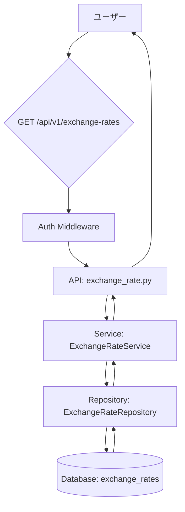
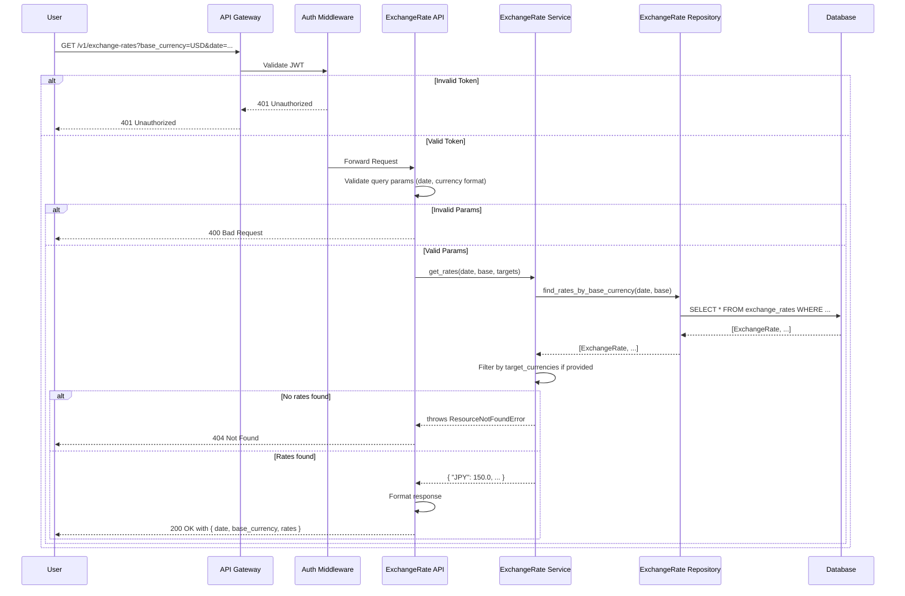

# 技術設計書: 為替レートAPIの機能拡張

## 1. 概要

**目的**: この機能は、為替レート取得API (`/api/v1/exchange-rates`) を拡張し、ユーザーが特定の日付、基準通貨、対象通貨に基づいて為替レート情報を柔軟に取得できるようにします。

**ユーザー**: 複数通貨でサブスクリプションを管理するユーザーが、正確な通貨換算を行うためにこの機能を利用します。

**影響**: 既存のエンドポイントを修正し、より柔軟なクエリ機能を提供します。これにより、フロントエンドは特定の日に複数の通貨レートを一度に問い合わせできるようになり、UXが向上します。

### 1.1. ゴール

-   指定された日付、基準通貨、対象通貨リストに基づいて為替レートを取得する機能を提供する。
-   APIの応答形式を `{ "date": "YYYY-MM-DD", "base_currency": "USD", "rates": { "JPY": 150.0, ... } }` とする。
-   不正なパラメータに対して適切なHTTPエラーステータス (400, 404) を返す。
-   エンドポイントをJWT認証で保護する。

### 1.2. 非ゴール

-   為替レートの換算計算機能の実装。
-   為替レートデータのリアルタイム更新機能。データは日次バッチで更新される前提です。

## 2. アーキテクチャ

### 2.1. 既存アーキテクチャの分析

現在のシステムは、Flask上に構築された3層アーキテクチャ（API層、サービス層、リポジトリ層）を採用しています。
-   **API層 (`exchange_rate.py`)**: HTTPリクエストを処理し、基本的なバリデーションを行います。
-   **サービス層 (`exchange_rate_service.py`)**: ビジネスロジックを担当しますが、現在はリポジトリを呼び出すだけの単純なものです。
-   **リポジトリ層 (`exchange_rate_repository.py`)**: SQLAlchemyを介してデータベース操作を抽象化します。
-   **モデル (`exchange_rate.py`)**: `exchange_rates` テーブルのORMモデルを定義します。

既存のエンドポイントは、2つの通貨ペア (`from_currency`, `to_currency`) の単一レート取得のみをサポートしており、要求される柔軟なクエリ機能が不足しています。また、認証も実装されていません。

### 2.2. 高度なアーキテクチャ

この機能拡張は、既存のアーキテクチャパターンを完全に踏襲します。API、サービス、リポジトリの各層に新しいロジックを追加・拡張することで対応します。



**アーキテクチャ統合**:
-   **既存パターンの維持**: 3層アーキテクチャを維持し、各層の責務分離を徹底します。
-   **コンポーネントの拡張**: `ExchangeRateService` と `ExchangeRateRepository` に新しいメソッドを追加し、既存の `get_exchange_rate` APIエンドポイントをこれらの新しいメソッドを利用するようにリファクタリングします。
-   **技術スタック整合性**: Flask, SQLAlchemy, `flask-jwt-extended` といった既存の技術スタックに準拠します。

## 3. システムフロー

### APIリクエストのシーケンス図



## 4. コンポーネントとインターフェース

### 4.1. API層

#### `app/api/v1/exchange_rate.py`

**責務**:
-   HTTPリクエストを受け取り、レスポンスを返す。
-   `flask-jwt-extended` を用いてJWT認証を強制する。
-   クエリパラメータ (`date`, `base_currency`, `target_currencies`) を検証する。
-   `ExchangeRateService` を呼び出し、結果をJSON形式で返す。

**API契約**:

| Method | Endpoint | Request (Query Params) | Response (200 OK) | Errors |
| :--- | :--- | :--- | :--- | :--- |
| GET | `/api/v1/exchange-rates` | `date: string` (YYYY-MM-DD, optional)<br>`base_currency: string` (ISO 4217, optional, default: "USD")<br>`target_currencies: string` (comma-separated, optional) | `ExchangeRateResponse` | 400, 401, 404, 500 |

**スキーマ定義**:
```typescript
// Request (Query Parameters)
interface ExchangeRateRequest {
  date?: string; // YYYY-MM-DD format
  base_currency?: string; // 3-letter currency code
  target_currencies?: string; // e.g., "JPY,EUR,GBP"
}

// Response
interface ExchangeRateResponse {
  date: string;
  base_currency: string;
  rates: {
    [currency_code: string]: number;
  };
}
```

### 4.2. サービス層

#### `app/services/exchange_rate_service.py`

**責務**:
-   為替レート取得に関するビジネスロジックを実装する。
-   `ExchangeRateRepository` からデータを取得する。
-   `target_currencies` に基づいてレートをフィルタリングする。
-   基準通貨が "USD" 以外の場合のレート再計算ロジックをカプセル化する (将来的な拡張)。

**サービスインターフェース**:
```python
class ExchangeRateService:
    def get_rates_for_base_currency(
        self,
        target_date: date,
        base_currency: str,
        target_currencies: list[str] | None
    ) -> dict[str, float]:
        """
        指定された基準通貨に対する為替レートの辞書を取得する。
        """
        # ...
```

### 4.3. リポジトリ層

#### `app/repositories/exchange_rate_repository.py`

**責務**:
-   データベースから為替レートデータを取得するためのクエリを抽象化する。

**リポジトリインターフェース**:
```python
class ExchangeRateRepository:
    def find_rates_by_base_currency(
        self,
        target_date: date,
        base_currency: str
    ) -> list[ExchangeRate]:
        """
        指定された日付以前で最新の、基準通貨に一致するすべての為替レートを取得する。
        """
        # ...
```

## 5. データモデル

### 5.1. 物理データモデル

既存の `ExchangeRate` モデル (`app/models/exchange_rate.py`) をそのまま利用します。このモデルは、要求されるクエリをサポートするのに十分な構造を持っています。

**`exchange_rates` テーブル**:
-   `from_currency` (String, PK)
-   `to_currency` (String, PK)
-   `date` (Date, PK)
-   `rate` (Float)
-   `source` (String)
-   `created_at` (DateTime)
-   `updated_at` (DateTime)

この設計では、`base_currency` は `from_currency` にマッピングされます。

## 6. エラーハンドリング

| HTTP Status | トリガー条件 | レスポンス |
| :--- | :--- | :--- |
| 400 Bad Request | - `date` のフォーマットが不正 (YYYY-MM-DD以外)。<br>- `base_currency` または `target_currencies` に無効な通貨コードが含まれる。 | `{ "msg": "説明" }` |
| 401 Unauthorized | - リクエストに有効なJWTが含まれていない。 | `{ "msg": "Missing Authorization Header" }` |
| 404 Not Found | - 指定された `date` と `base_currency` に該当する為替レートが存在しない。 | `{ "msg": "Exchange rate not found" }` |
| 500 Internal Server Error | - 予期せぬサーバー内部のエラー。 | `{ "msg": "An unexpected error occurred" }` |

## 7. テスト戦略

### 7.1. ユニットテスト

-   **Repository**: `find_rates_by_base_currency` が正しいクエリを生成し、データを返すことを検証する。
-   **Service**:
    -   `target_currencies` によるフィルタリングが正しく機能すること。
    -   レートが見つからない場合に `ResourceNotFoundError` を送出すること。
-   **API**:
    -   `date` パラメータのフォーマット検証が機能すること。
    -   通貨コードの検証が機能すること。

### 7.2. 統合テスト (`tests/integration/test_exchange_rate_api.py`)

-   有効なJWTで保護されていることを確認するテスト。
-   `date`, `base_currency`, `target_currencies` の各パラメータを単独・組み合わせて使用し、期待されるレスポンスが返ることを検証する。
-   不正なパラメータ（不正な日付、無効な通貨コード）でリクエストを送信し、400エラーが返ることを確認する。
-   データが存在しない条件でリクエストを送信し、404エラーが返ることを確認する。

## 8. セキュリティに関する考慮事項

-   **認証**: エンドポイントは `@jwt_required()` デコレータを使用して保護され、認証されたユーザーのみがアクセスできるようにします。
-   **入力検証**: すべてのクエリパラメータは、SQLインジェクションやその他の攻撃を防ぐために厳密に検証されます。特に、通貨コードは既知のリストに対して検証されます。
