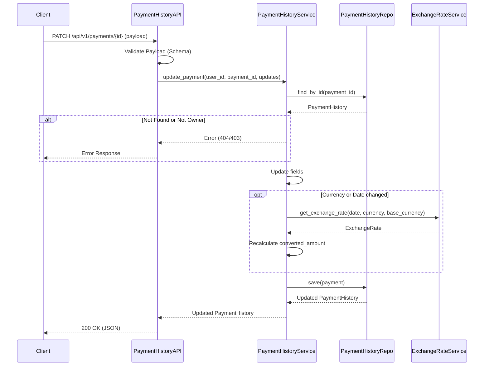

# Design Document: Update Payment History API

---
**Purpose**: Provide sufficient detail to ensure implementation consistency across different implementers, preventing interpretation drift.

**Approach**:
- Include essential sections that directly inform implementation decisions
- Omit optional sections unless critical to preventing implementation errors
- Match detail level to feature complexity
- Use diagrams and tables over lengthy prose
---

## Overview
**Purpose**: 本機能は、ユーザーが登録済みの支払履歴を修正するためのAPIを提供します。
**Users**: 家計簿アプリの登録ユーザー。
**Impact**: ユーザーは誤って入力した支払額や日付、通貨を後から訂正できるようになり、データの正確性が向上します。特に、支払日や通貨を変更した際には自動的に為替レートが再計算され、円換算額が適切に更新されます。

### Goals
- 既存の支払履歴IDを指定して、任意項目（金額、日付、通貨、サブスクリプション、支払方法）を更新できること。
- 通貨または日付変更時に、システムが保持する為替レートを用いて換算額を自動再計算すること。
- 他人のデータを更新できないよう、適切な権限チェックを行うこと。

### Non-Goals
- 複数の支払履歴の一括更新（Bulk Update）。
- 削除済みの支払履歴の復元。

## Architecture

### Architecture Pattern & Boundary Map
本機能は既存のレイヤードアーキテクチャ（Controller - Service - Repository）に従い、既存のコンポーネントを拡張する形で実装します。

**Architecture Integration**:
- **Selected pattern**: Layered Architecture (Flask Blueprint -> Service -> Repository)
- **Domain/feature boundaries**: `PaymentHistory` ドメイン内の操作として完結。
- **Existing patterns preserved**: Dependency Injection, Repository Pattern, SQLAlchemy Session management.

### Technology Stack

| Layer | Choice / Version | Role in Feature | Notes |
|-------|------------------|-----------------|-------|
| Backend / Services | Python 3.13 / Flask | API Endpoint & Logic | 既存スタック維持 |
| Data / Storage | SQLAlchemy / SQLite | Data Persistence | 既存スタック維持 |
| Validation | Marshmallow | Input Validation | 部分更新(PATCH)対応 |

## System Flows

### Update Payment Flow



## Requirements Traceability

| Requirement | Summary | Components | Interfaces | Flows |
|-------------|---------|------------|------------|-------|
| 1.1, 1.2 | PATCH エンドポイントと部分更新 | PaymentHistoryAPI | `PATCH /payments/{id}` | Update Flow |
| 1.3 | 不正なデータ型の処理 | PaymentHistoryAPI | Marshmallow Schema | - |
| 1.4, 1.5, 1.6 | 存在確認と権限チェック | PaymentHistoryService | `update_payment` | Update Flow |
| 2.1, 2.2 | データのDB更新 | PaymentHistoryRepository | `save` | - |
| 2.3 | サブスクリプション名更新 | PaymentHistoryService | `update_payment` | - |
| 2.4, 2.5 | ビジネスルール検証 | PaymentHistoryService | `update_payment` | - |
| 3.1, 3.2 | 為替レート再計算 | PaymentHistoryService | `update_payment` | Update Flow |
| 3.3 | 同一通貨のケース | PaymentHistoryService | `update_payment` | - |
| 3.4 | レート不足エラー | PaymentHistoryService | `update_payment` | - |

## Components and Interfaces

### [API Layer]

#### [PaymentHistoryAPI]

| Field | Detail |
|-------|--------|
| Intent | HTTPリクエストの受付、バリデーション、レスポンス生成 |
| Requirements | 1.1, 1.2, 1.3, 1.6 |

**Responsibilities & Constraints**
- 入力JSONのバリデーション（Marshmallow）
- 認証コンテキスト（Current User）の取得
- 適切なHTTPステータスコードの返却

**Dependencies**
- Outbound: `PaymentHistoryService` — ビジネスロジックの実行 (P0)

**Contracts**: API [x]

##### API Contract
| Method | Endpoint | Request | Response | Errors |
|--------|----------|---------|----------|--------|
| PATCH | `/api/v1/payments/{payment_id}` | `PaymentUpdateRequest` (Partial) | `PaymentHistoryResponse` | 400, 401, 403, 404 |

**Implementation Notes**
- `PaymentUpdateRequestSchema` を定義し、全フィールドを `required=False` (Optional) に設定する。
- バリデーションエラー時は 400 を返す。

### [Service Layer]

#### [PaymentHistoryService]

| Field | Detail |
|-------|--------|
| Intent | 支払履歴更新のビジネスロジック、権限チェック、計算処理 |
| Requirements | 1.4, 1.5, 2.x, 3.x |

**Responsibilities & Constraints**
- データの所有権確認 (`user_id` チェック)
- サブスクリプション存在確認（ID変更時）
- 為替レートの取得と換算額の計算（必要な場合のみ）
- トランザクション管理（Repository経由）

**Dependencies**
- Inbound: `PaymentHistoryAPI` — 呼び出し元
- Outbound: `PaymentHistoryRepository` — データ永続化 (P0)
- Outbound: `SubscriptionRepository` — サブスクリプション情報の取得 (P1)
- Outbound: `ExchangeRateService` — レート取得 (P1)

**Contracts**: Service [x]

##### Service Interface
```python
class PaymentHistoryService:
    def update_payment(self, user_id: int, payment_id: int, updates: dict) -> PaymentHistory:
        """
        指定された支払履歴を更新する。
        
        Args:
            user_id: リクエストを行ったユーザーID
            payment_id: 更新対象の支払履歴ID
            updates: 更新するフィールドを含む辞書
            
        Returns:
            更新後のPaymentHistoryオブジェクト
            
        Raises:
            ResourceNotFoundError: 対象が見つからない、またはレートが見つからない場合
            ForbiddenError: 他人のデータを更新しようとした場合
            ValidationError: バリデーションやビジネスルール違反
        """
        pass
```

## Data Models

### Data Contracts & Integration

**PaymentUpdateRequest (Marshmallow Schema)**
```python
class PaymentUpdateRequestSchema(Schema):
    subscription_id = fields.Int(required=False)
    payment_date = fields.Date(required=False)
    amount = fields.Float(required=False, validate=validate.Range(min=0.01))
    currency = fields.Str(required=False, validate=validate.Length(equal=3))
    payment_method = fields.Str(required=False)
    # create時と異なりすべて任意項目
```

## Error Handling

### Error Strategy
- **ResourceNotFoundError**:
    - 指定IDのレコードがない場合 -> 404
    - 指定日付・通貨の為替レートがない場合 -> 400 (Client Errorとして扱う)
- **ForbiddenError**:
    - 所有者不一致 -> 404 (セキュリティのため存在を隠蔽) または 403
- **ValidationError**:
    - 入力値不正 -> 400

## Testing Strategy

- **Unit Tests**:
    - `PaymentHistoryService.update_payment`:
        - 正常系（金額のみ更新）
        - 正常系（日付変更 -> レート再計算）
        - 正常系（通貨変更 -> レート再計算）
        - 異常系（他人のデータ）
        - 異常系（レート取得失敗）
- **Integration Tests**:
    - APIエンドポイント (`PATCH /payments/{id}`) の結合テスト。
    - DBへの保存とレスポンスの確認。
