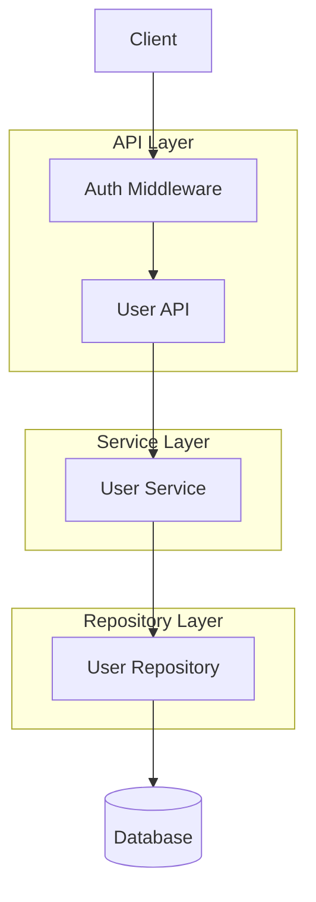

# Technical Design Document

## Overview

本ドキュメントは、ユーザー情報更新API `PATCH /api/v1/users/{userId}` の技術設計を定義する。このAPIは、認証済みユーザーが自身のプロフィール情報（ユーザー名、メールアドレス、基準通貨）を部分更新する機能を提供する。

**Purpose**: 認証済みユーザーが自身のアカウント情報を最新の状態に保つための更新機能を提供する。

**Users**: 登録済みユーザーがプロフィール設定画面から自身の情報を更新する際に利用する。

**Impact**: 既存のPATCH /users/{userId}エンドポイントの機能強化。バリデーションの追加と空リクエストのエラーハンドリング改善。

### Goals
- ユーザー情報の安全な部分更新機能の提供
- 入力データの適切なバリデーション
- 既存アーキテクチャパターンとの一貫性維持
- 明確なエラーレスポンスの提供

### Non-Goals
- パスワード変更機能（別エンドポイント `/users/{userId}/change-password` で提供）
- ユーザー削除機能（別エンドポイント DELETE `/users/{userId}` で提供）
- 他のユーザーのプロフィール更新（認可で拒否）

## Architecture

### Existing Architecture Analysis

本機能は既存の3層アーキテクチャを拡張する：

- **API層** (`app/api/v1/user.py`): HTTPリクエスト処理、認証・認可
- **Service層** (`app/services/user_service.py`): ビジネスロジック、バリデーション
- **Repository層** (`app/repositories/user_repository.py`): データアクセス

既存のPATCH /users/{userId}エンドポイントは実装済みだが、一部バリデーションが不完全。

### Architecture Pattern & Boundary Map



**Architecture Integration**:
- Selected pattern: 既存の3層アーキテクチャを拡張
- Domain/feature boundaries: ユーザープロフィール管理ドメイン
- Existing patterns preserved: JWT認証、成功/エラーレスポンス形式、例外処理
- New components rationale: 新規コンポーネントは不要、既存コンポーネントを拡張
- Steering compliance: `.kiro/steering/structure.md` のレイヤー構造に準拠

### Technology Stack

| Layer | Choice / Version | Role in Feature | Notes |
|-------|------------------|-----------------|-------|
| Backend / Services | Flask 3.1.0 | APIフレームワーク | 既存 |
| Backend / Services | SQLAlchemy 2.0.40 | ORM | 既存 |
| Backend / Services | flask-jwt-extended 4.7.1 | JWT認証 | 既存 |
| Data / Storage | SQLite | データベース | 既存 |

## Requirements Traceability

| Requirement | Summary | Components | Interfaces | Flows |
|-------------|---------|------------|------------|-------|
| 1.1 | JWT認証済みユーザーのプロフィール更新 | UserService | PATCH /users/{userId} | メインフロー |
| 1.2 | ユーザー名の長さバリデーション（3-32文字） | UserService | update_user() | バリデーション |
| 1.3 | メール形式・重複バリデーション | UserService | update_user() | バリデーション |
| 1.4 | 通貨コードバリデーション（JPY/USD/EUR/GBP） | UserService | update_user() | バリデーション |
| 1.5 | 更新成功レスポンス返却 | UserAPI | success_response() | 成功フロー |
| 2.1 | JWTトークンなしで401エラー | AuthMiddleware | jwt_required_custom | 認証エラー |
| 2.2 | 他ユーザー更新で403エラー | UserAPI | PATCH /users/{userId} | 認可エラー |
| 2.3 | 存在しないユーザーIDで404エラー | UserService | update_user() | リソースエラー |
| 2.4 | リクエスト送信者とパスパラメータのユーザーID一致検証 | UserAPI | PATCH /users/{userId} | 認可チェック |
| 3.1 | ユーザー名長さ無効で400エラー | UserService | update_user() | バリデーション |
| 3.2 | メール重複で400エラー | UserService | update_user() | バリデーション |
| 3.3 | 無効な通貨コードで400エラー | UserService | update_user() | バリデーション |
| 3.4 | 無効なメールフォーマットで400エラー | UserService | update_user() | バリデーション |
| 3.5 | 空のリクエストボディで400エラー | UserAPI | PATCH /users/{userId} | リクエスト検証 |
| 4.1 | 部分更新（指定フィールドのみ更新） | UserService | update_user() | 更新フロー |
| 4.2 | 空のJSONオブジェクトで400エラー | UserAPI | PATCH /users/{userId} | リクエスト検証 |
| 4.3 | 複数フィールドの原子的更新 | UserService | update_user() | 更新フロー |
| 5.1 | 成功時dataフィールド返却 | UserAPI | success_response() | レスポンス形式 |
| 5.2 | 成功時HTTP 200 | UserAPI | success_response() | レスポンス形式 |
| 5.3 | エラー時errorフィールド返却 | UserAPI | jsonify() | エラーレスポンス |
| 5.4 | レスポンスに全ユーザー情報含める | UserAPI | PATCH /users/{userId} | レスポンス形式 |

## Components and Interfaces

| Component | Domain/Layer | Intent | Req Coverage | Key Dependencies (P0/P1) | Contracts |
|-----------|--------------|--------|--------------|--------------------------|-----------|
| UserAPI | API | ユーザープロフィール更新エンドポイント | 1.1-1.5, 2.1-2.4, 3.5, 4.2, 5.1-5.4 | AuthMiddleware (P0), UserService (P0) | API |
| UserService | Service | ユーザー更新ビジネスロジック | 1.1-1.5, 2.3, 3.1-3.4, 4.1, 4.3 | UserRepository (P0), User Model (P0) | Service |
| UserRepository | Repository | ユーザーデータアクセス | 2.3 | User Model (P0), Database (P0) | Service |
| AuthMiddleware | Common | JWT認証・認可 | 2.1 | flask-jwt-extended (P0) | - |

### API Layer

#### UserAPI

| Field | Detail |
|-------|--------|
| Intent | ユーザープロフィール更新リクエストを処理し、認証・認可・バリデーションを経て更新を実行 |
| Requirements | 1.1, 1.5, 2.1, 2.2, 2.4, 3.5, 4.2, 5.1, 5.2, 5.3, 5.4 |
| Owner / Reviewers | - |

**Responsibilities & Constraints**
- HTTPリクエストの受信とJSONパース
- JWT認証の強制（`@jwt_required_custom`）
- リクエスト送信者とパスパラメータのユーザーID一致確認
- 空リクエストボディ・空JSONオブジェクトの検出
- 成功・エラーレスポンスの標準形式での返却

**Dependencies**
- Inbound: Client — HTTPリクエスト送信 (P0)
- Outbound: UserService — ユーザー更新実行 (P0)
- External: flask-jwt-extended — JWT検証 (P0)

**Contracts**: Service [ ] / API [x] / Event [ ] / Batch [ ] / State [ ]

##### API Contract

| Method | Endpoint | Request | Response | Errors |
|--------|----------|---------|----------|--------|
| PATCH | /api/v1/users/{userId} | UserUpdateRequest | UserResponse | 400, 401, 403, 404 |

**Request Schema (UserUpdateRequest)**:
| Field | Type | Required | Constraints |
|-------|------|----------|-------------|
| username | string | No | 3-32文字 |
| email | string | No | 有効なメールフォーマット |
| base_currency | string | No | "JPY", "USD", "EUR", "GBP" |

**Response Schema (UserResponse)**:
| Field | Type | Description |
|-------|------|-------------|
| id | string | ユーザーID |
| username | string | ユーザー名 |
| email | string | メールアドレス |
| base_currency | string | 基準通貨 |
| created_at | string (ISO8601) | 作成日時 |

**Implementation Notes**
- Integration: 既存の`update_user`エンドポイントを拡張
- Validation: 空のJSONオブジェクト`{}`を400エラーとして処理
- Risks: 既存テストとの互換性確認が必要

### Service Layer

#### UserService

| Field | Detail |
|-------|--------|
| Intent | ユーザー情報更新のビジネスロジックとバリデーションを実行 |
| Requirements | 1.1-1.5, 2.3, 3.1-3.4, 4.1, 4.3 |
| Owner / Reviewers | - |

**Responsibilities & Constraints**
- ユーザー名の長さバリデーション（3-32文字）
- メールアドレスの形式・重複バリデーション
- 通貨コードの有効性バリデーション
- 部分更新の実行（指定フィールドのみ更新）
- 複数フィールドの原子的更新

**Dependencies**
- Inbound: UserAPI — 更新リクエスト受信 (P0)
- Outbound: UserRepository — データ永続化 (P0)
- External: User Model — データモデル (P0)

**Contracts**: Service [x] / API [ ] / Event [ ] / Batch [ ] / State [ ]

##### Service Interface

```python
class UserService:
    def update_user(self, user_id: int, data: dict[str, Any]) -> User:
        """
        ユーザー情報を更新する。
        
        Args:
            user_id: 更新対象のユーザーID
            data: 更新データ（username, email, base_currencyの部分集合）
        
        Returns:
            User: 更新後のユーザーモデル
        
        Raises:
            ValueError: バリデーションエラー
            UserNotFoundError: ユーザーが存在しない場合
        """
        pass
```

**Preconditions**:
- `user_id` は有効な整数
- `data` は辞書型で、少なくとも1つの更新フィールドを含む

**Postconditions**:
- 指定されたフィールドのみが更新される
- 他のフィールドは変更されない
- データベースに変更が永続化される

**Invariants**:
- ユーザー名は3文字以上32文字以下
- メールアドレスは一意
- 通貨コードは有効な値

**Implementation Notes**
- Integration: 既存の`update_user`メソッドを拡張
- Validation: ユーザー名長さチェックを追加
- Risks: なし

### Repository Layer

#### UserRepository

| Field | Detail |
|-------|--------|
| Intent | ユーザーデータの永続化操作 |
| Requirements | 2.3 |
| Owner / Reviewers | - |

**Responsibilities & Constraints**
- ユーザーの検索・保存・削除

**Dependencies**
- Inbound: UserService — データアクセス要求 (P0)
- External: Database — データ永続化 (P0)

**Contracts**: Service [x] / API [ ] / Event [ ] / Batch [ ] / State [ ]

##### Service Interface

```python
class UserRepository:
    def find_by_id(self, user_id: int) -> User | None:
        """ユーザーIDでユーザーを検索する"""
        pass
    
    def save(self, user: User) -> User:
        """ユーザーを保存する"""
        pass
```

**Implementation Notes**
- Integration: 既存実装を変更なし
- Validation: なし
- Risks: なし

## Data Models

### Domain Model

**User Entity**:
- ユーザー情報を表す集約ルート
- 属性: user_id, username, password_hash, email, base_currency, created_at, updated_at
- 不変条件: ユーザー名は一意、メールアドレスは一意

### Logical Data Model

**User Table (users)**:
| Column | Type | Constraints | Description |
|--------|------|-------------|-------------|
| user_id | INTEGER | PRIMARY KEY, AUTO_INCREMENT | ユーザーID |
| username | VARCHAR(32) | UNIQUE, NOT NULL | ユーザー名 |
| password_hash | VARCHAR(128) | NOT NULL | パスワードハッシュ |
| email | VARCHAR(255) | UNIQUE, NOT NULL | メールアドレス |
| base_currency | VARCHAR(3) | NOT NULL, DEFAULT 'USD' | 基準通貨 |
| created_at | DATETIME | NOT NULL | 作成日時 |
| updated_at | DATETIME | NOT NULL | 更新日時 |

**Consistency & Integrity**:
- 更新は単一テーブルへの原子的操作
- 外部キー制約: subscriptions, labels, payment_historiesがuser_idを参照

## Error Handling

### Error Strategy

各エラータイプに対する具体的なハンドリングパターン:

### Error Categories and Responses

**User Errors (4xx)**:
| Error | HTTP Status | Code | Message | Condition |
|-------|-------------|------|---------|----------|
| 空のリクエストボディ | 400 | 400 | "Invalid JSON" | リクエストボディがnull |
| 空のJSONオブジェクト | 400 | 400 | "更新するフィールドがありません" | `{}`を受信 |
| ユーザー名短すぎ | 400 | 400 | "ユーザー名は3文字以上必要です" | username < 3文字 |
| ユーザー名長すぎ | 400 | 400 | "ユーザー名は32文字以下です" | username > 32文字 |
| 無効なメール形式 | 400 | 400 | "無効なメールアドレス形式です" | メール形式不正 |
| メール重複 | 400 | 400 | "このメールアドレスは既に使用されています" | 既存メールと重複 |
| 無効な通貨コード | 400 | 400 | "無効な通貨コードです: {currency}" | JPY/USD/EUR/GBP以外 |
| 未認証 | 401 | 401 | "Unauthorized access" | JWTトークンなし/無効 |
| 他ユーザー更新 | 403 | 403 | "他のユーザーのプロフィールは更新できません" | 他ユーザーID指定 |
| ユーザー不在 | 404 | 404 | "ユーザーが見つかりません" | 存在しないユーザーID |

**System Errors (5xx)**:
| Error | HTTP Status | Code | Message | Condition |
|-------|-------------|------|---------|----------|
| データベースエラー | 500 | 500 | "Internal server error" | 予期しない例外 |

### Monitoring

- エラーログは `app.common.logging_setup` で記録
- 警告レベルで不正アクセス試行を記録

## Testing Strategy

### Unit Tests
- `UserService.update_user()` の正常系・異常系
- ユーザー名長さバリデーション
- メール重複バリデーション
- 通貨コードバリデーション
- 部分更新の正確性

### Integration Tests
- 認証済みユーザーの更新成功
- 未認証ユーザーの401エラー
- 他ユーザー更新の403エラー
- 存在しないユーザーの404エラー
- 空のJSONオブジェクトの400エラー

### E2E/UI Tests
- プロフィール更新フロー（フロントエンド統合時）

### Performance/Load
- 特別なパフォーマンステストは不要（単一レコード更新）

## Security Considerations

- **認証**: JWTトークンによる認証を強制（2.1）
- **認可**: 自分のプロフィールのみ更新可能（2.2, 2.4）
- **入力検証**: すべての入力フィールドに対するバリデーション（3.1-3.5）
- **ログ**: 不正アクセス試行の記録

## Performance & Scalability

- 特別なパフォーマンス要件なし
- 単一レコードの更新操作のため、負荷は軽微
