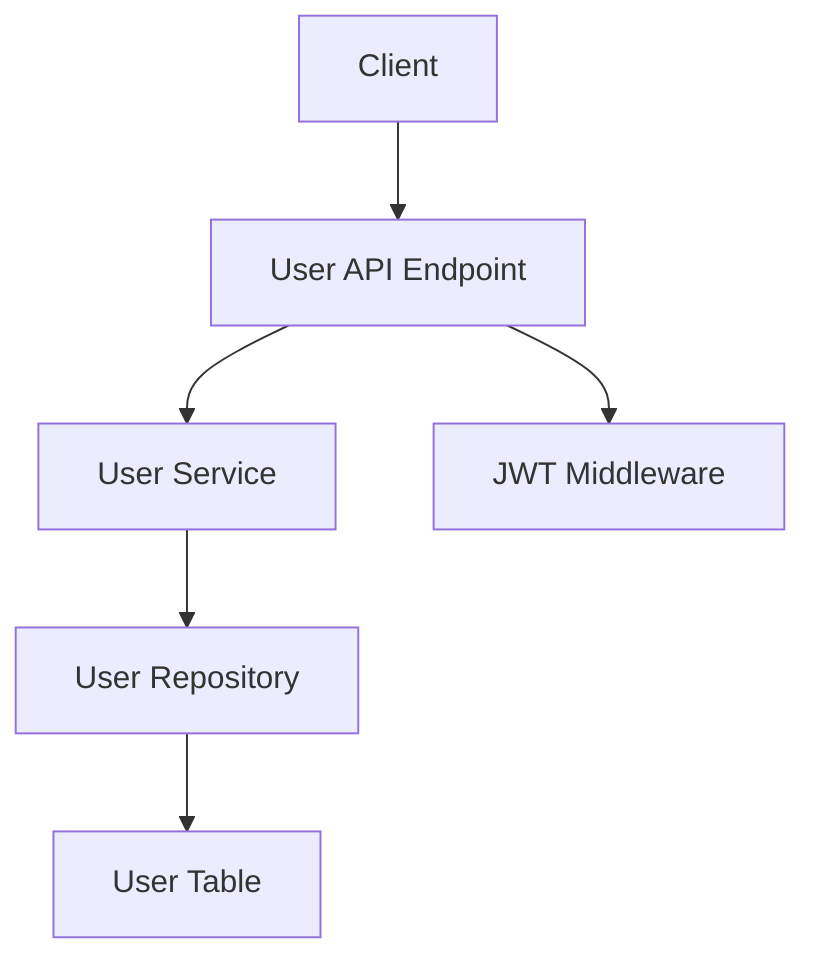

# Design Document

## Overview

ユーザープロフィールAPIは、認証済みユーザーが自身のプロフィール情報（ユーザー名、メールアドレス、基準通貨）を取得・更新するためのREST APIを提供する。

**Purpose**: ユーザーが設定画面で自身の情報を確認・変更できるようにする。

**Users**: 登録ユーザーがプロフィール設定のために利用する。

### Goals
- ユーザーがプロフィール情報を取得・更新できる
- セキュリティ（認証・認可）を確保する
- 一貫したAPIレスポンス形式を提供する

### Non-Goals
- パスワード変更機能（別途実装予定）
- アカウント削除機能（別途実装予定）

## Architecture

### Existing Architecture Analysis
- **Current architecture**: レイヤードアーキテクチャ（API→Service→Repository）
- **Existing domain boundaries**: Userモデルは`app/models/user.py`に定義
- **Integration points**: JWT認証、共通レスポンス形式
- **Technical debt**: なし（新規実装）

### Architecture Pattern & Boundary Map


**Architecture Integration**:
- Selected pattern: レイヤードアーキテクチャ（既存パターンに準拠）
- Domain/feature boundaries: Userドメイン内で完結
- Existing patterns preserved: Blueprint、JWT認証、success_response
- New components rationale: 既存のUserモデルを活用

### Technology Stack

| Layer | Choice / Version | Role in Feature | Notes |
|-------|------------------|-----------------|-------|
| Backend / Services | Flask 3.1.0 | REST APIフレームワーク | 既存 |
| Backend / Services | Flask-JWT-Extended ^4.7.1 | JWT認証 | 既存 |
| Data / Storage | SQLite + SQLAlchemy ^2.0.40 | データ永続化 | 既存 |

## Requirements Traceability

| Requirement | Summary | Components | Interfaces | Flows |
|-------------|---------|------------|------------|-------|
| 1.1 | プロフィール取得 | UserAPI, UserService | GET /users/{id} | - |
| 1.2 | 未認証エラー | JWTMiddleware | 401 response | - |
| 1.3 | 他ユーザー禁止 | UserAPI | 403 response | - |
| 1.4 | 存在しないユーザー | UserService | 404 response | - |
| 2.1 | プロフィール更新 | UserAPI, UserService | PATCH /users/{id} | - |
| 2.2-2.4 | バリデーション | UserService | 400 response | - |
| 2.5 | メール重複 | UserService | 400 response | - |
| 2.6 | 無効な通貨 | UserService | 400 response | - |
| 2.7-2.9 | エラーハンドリング | UserAPI, JWTMiddleware | 各種エラー | - |
| 3.1 | 部分更新 | UserService | PATCH | - |
| 3.2 | 空オブジェクト | UserService | 変更なしで返却 | - |
| 4.1-4.3 | レスポンス形式 | UserAPI | success_response | - |

## Components and Interfaces

| Component | Domain/Layer | Intent | Req Coverage | Key Dependencies | Contracts |
|-----------|--------------|--------|--------------|------------------|-----------|
| UserAPI | API | HTTPエンドポイント | 1.x, 2.x, 4.x | UserService (P0), JWTMiddleware (P0) | API |
| UserService | Service | ビジネスロジック | 1.x, 2.x, 3.x | UserRepository (P0) | Service |
| UserRepository | Repository | データアクセス | 1.x, 2.x | User Model (P0) | - |
| User Model | Data | データモデル | 1.1, 2.2-2.4 | SQLAlchemy (P0) | - |

### API Layer

#### UserAPI

| Field | Detail |
|-------|--------|
| Intent | ユーザープロフィールの取得・更新エンドポイント |
| Requirements | 1.1-1.4, 2.1-2.9, 3.1-3.2, 4.1-4.3 |

**Responsibilities & Constraints**
- HTTPリクエストの処理とレスポンスの生成
- 認証・認可の確認（自分のプロフィールのみアクセス可能）
- バリデーションエラーの適切なエラーレスポンス返却

**Dependencies**
- Inbound: HTTP Client — リクエスト送信 (P0)
- Outbound: UserService — ビジネスロジック実行 (P0)
- External: JWTMiddleware — 認証検証 (P0)

**Contracts**: Service [ ] / API [x] / Event [ ] / Batch [ ] / State [ ]

##### API Contract
| Method | Endpoint | Request | Response | Errors |
|--------|----------|---------|----------|--------|
| GET | /api/v1/users/{userId} | - | UserProfile | 401, 403, 404 |
| PATCH | /api/v1/users/{userId} | UserUpdateRequest | UserProfile | 400, 401, 403 |

### Service Layer

#### UserService

| Field | Detail |
|-------|--------|
| Intent | ユーザープロフィール関連のビジネスロジック |
| Requirements | 1.1, 1.4, 2.1-2.6, 3.1-3.2 |

**Responsibilities & Constraints**
- ユーザー情報の取得・更新
- バリデーション（通貨コード、メール重複）
- 部分更新の処理

**Dependencies**
- Inbound: UserAPI — リクエスト処理 (P0)
- Outbound: UserRepository — データアクセス (P0)

**Contracts**: Service [x] / API [ ] / Event [ ] / Batch [ ] / State [ ]

##### Service Interface
```python
class UserService:
    VALID_CURRENCIES: set[str] = {"JPY", "USD", "EUR", "GBP"}

    def get_user_by_id(self, user_id: int) -> User | None
    def update_user(self, user_id: int, data: dict[str, Any]) -> User
```
- Preconditions: user_id は有効な整数
- Postconditions: 更新成功時は User オブジェクトを返す
- Invariants: base_currency は VALID_CURRENCIES のいずれか

## Data Models

### Domain Model
- **Aggregate**: User
- **Entity**: User（ユーザー情報）
- **Value Objects**: base_currency（通貨コード）
- **Business Rules**:
  - ユーザー名は3文字以上32文字以下
  - メールアドレスは一意
  - 基準通貨は JPY, USD, EUR, GBP のいずれか

### Logical Data Model

**Structure Definition**:
| Attribute | Type | Constraints |
|-----------|------|-------------|
| user_id | Integer | PK, Auto-increment |
| username | String(32) | Unique, Not Null |
| email | String(255) | Unique, Not Null |
| base_currency | String(3) | Not Null, Default: USD |
| created_at | DateTime | Not Null |
| updated_at | DateTime | Not Null |

**Consistency & Integrity**:
- トランザクション境界: ユーザー更新は単一トランザクション
- 参照整合性: なし（独立エンティティ）

### Data Contracts & Integration

**API Data Transfer**
```python
# Response Schema
UserProfile = {
    "id": str,
    "username": str,
    "email": str,
    "base_currency": str,  # enum: JPY, USD, EUR, GBP
    "created_at": str  # ISO 8601
}

# Request Schema
UserUpdateRequest = {
    "username"?: str,  # 3-32 chars
    "email"?: str,  # valid email format
    "base_currency"?: str  # enum: JPY, USD, EUR, GBP
}
```

## Error Handling

### Error Categories and Responses
**User Errors** (4xx):
- 400: Invalid JSON, 無効な通貨コード, メール重複
- 401: 未認証
- 403: 他ユーザーのプロフィールへのアクセス
- 404: ユーザーが見つからない

**System Errors** (5xx):
- 500: 予期しないエラー

### Error Response Format
```python
{
    "error": {
        "code": int,
        "message": str
    }
}
```

## Testing Strategy

### Unit Tests
- UserService.get_user_by_id 正常系
- UserService.update_user 部分更新
- UserService.update_user バリデーションエラー

### Integration Tests
- GET /users/{id} 認証済みユーザー
- GET /users/{id} 未認証
- GET /users/{id} 他ユーザー
- PATCH /users/{id} 正常更新
- PATCH /users/{id} 無効な通貨コード
- PATCH /users/{id} メール重複
