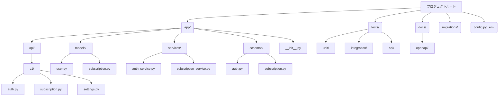

# Subscription Management API プロジェクト 初期化プラン

以下のステップでプロジェクトを初期化します。

## ディレクトリ構造


## ステップ詳細

1. ディレクトリ構造の作成  
   - `app/` 下に `api/v1/`, `models/`, `services/`, `schemas/` を作成  
   - 各ディレクトリに対応する空ファイルを配置  
   - ルートに `config.py` と `.env`（`.env.example` をコピー）を作成  
   - `tests/` 以下に `unit/`, `integration/`, `api/` を作成（各に `__init__.py` も）

2. 初期ファイルの内容  
   - `app/__init__.py`：Flask アプリファクトリと Blueprint 登録  
   - `config.py`：環境変数読み込みと設定クラス定義（Development/Testing/Production）  
   - `app/api/v1/*.py`：各エンドポイントの Blueprint スケルトン  
   - `app/models/*.py`：SQLAlchemy Base とモデル クラス定義の雛形  
   - `app/services/*.py`：ビジネスロジック用の関数 stubs  
   - `app/schemas/*.py`：Pydantic または Marshmallow スキーマ雛形

3. データベースマイグレーション  
   - `alembic init migrations` を実行して `migrations/` を生成  
   - `alembic.ini` の DB URL を `config.py` の設定に合わせて修正

4. テストフレームワーク設定  
   - `pytest.ini` または `pyproject.toml` に pytest 設定を追加  
   - `tests/conftest.py` に Flask `app` テストクライアントの fixture を用意

5. Poetry と依存関係  
   - 既存の `pyproject.toml` をベースに、`poetry install` で開発環境を構築  
   - `.env.example` から `.env` を作成し、必要な環境変数をセット

6. ドキュメント自動生成  
   - Sphinx の基本設定を追加し、`docs/libraries` を出力先に設定  
   - OpenAPI ファイルは `docs/openapi/*.yaml` に配置済

---

## 新規: ユーザ登録エンドポイント `/api/v1/auth/register` の追加

1. config.py の更新  
   - デフォルトの `SQLALCHEMY_DATABASE_URI` を  
     `sqlite:///data/subsctracker.dev.db` に変更  
   - プロジェクトルートに `data/` ディレクトリを作成

2. モデル定義の修正 (`app/models/user.py`)  
   - `USERS` テーブル定義に合わせて属性を変更:  
     - `user_id`: Integer, PK, autoincrement  
     - `username`: String, unique, not null  
     - `password_hash`: String, not null  
     - `email`: String, unique, not null  
     - `created_at`: DateTime, not null (default 現在時刻)  
     - `updated_at`: DateTime, not null (更新時刻を自動設定)  

3. スキーマ追加 (`app/schemas/auth.py`)  
   ```python
   class RegisterSchema(BaseModel):
       username: str = Field(..., description="ユーザー名")
       email: EmailStr = Field(..., description="メールアドレス")
       password: str = Field(..., min_length=6, description="パスワード")
   ```

4. サービス実装 (`app/services/auth_service.py`)  
   - `register_user(data: dict) -> dict` を実装:  
     1. `RegisterSchema` でバリデーション  
     2. UUID ではなく DB 自動発番の `user_id` を利用  
     3. `werkzeug.security.generate_password_hash` で `password_hash` を生成  
     4. `app.session` を使い `User` インスタンスを追加・コミット  
     5. 作成された `user_id` と `email` を返却

5. ルート追加 (`app/api/v1/auth.py`)  
   ```python
   @auth_bp.route("/register", methods=["POST"])
   def register():
       data = request.get_json() or {}
       new_user = register_user(data)
       return jsonify(new_user), 201
   ```

6. テスト作成 (tests/api/test_auth_register.py)  
   - 正常系: 新規ユーザ登録  
   - 異常系: 重複 email 登録時のエラー

7. OpenAPI ドキュメント更新  
   - `docs/openapi/auth.api.yaml` に `/register` エンドポイント定義を追加

---  
End of Plan